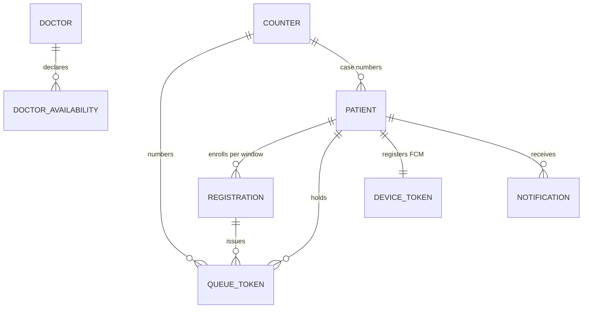
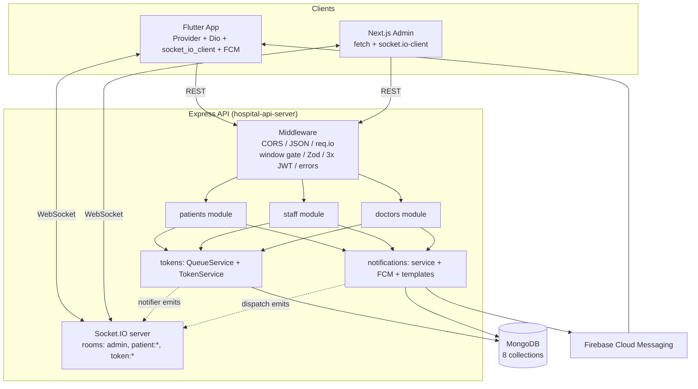

# MD.md — Complete Technical Reference: NextGen Hospital OPD Queue & Registration System

> **Document type:** Full codebase technical reference for developers.
> **Scope:** Entire `D:\Hospital` monorepo — backend API (`hospital-api-server`),
> staff dashboard (`hospital-admin-app`), patient/doctor mobile app (`hospital_patient_app`),
> plus root-level files.
> **Method:** Every file listed here was actually read and inspected. Nothing is assumed.
> Where something could not be determined from the code, it is marked
> **`Unknown / Requires Verification`**.
> **Secret policy:** This document contains **no secret values** (no passwords, PINs,
> API keys, tokens, or private keys). Only variable names and their purpose are documented.
> **Convention:** `Current Implementation` describes what the code does today.
> `Recommended` describes possible future improvements. The two are never mixed.

---

## Table of Contents

1. [Project Overview](#1-project-overview)
2. [Complete Folder Structure](#2-complete-folder-structure)
3. [File-by-File Documentation](#3-file-by-file-documentation)
4. [Module and Dependency Analysis](#4-module-and-dependency-analysis)
5. [Application Logic](#5-application-logic)
6. [Frontend Analysis (Next.js Admin Dashboard)](#6-frontend-analysis-nextjs-admin-dashboard)
7. [Backend Analysis (Express API Server)](#7-backend-analysis-express-api-server)
8. [Database Analysis](#8-database-analysis)
9. [API Documentation](#9-api-documentation)
10. [Configuration and Environment](#10-configuration-and-environment)
11. [Security Analysis](#11-security-analysis)
12. [Unused / Duplicate / Dead Code](#12-unused--duplicate--dead-code)
13. [Existing Logic vs Recommended Changes](#13-existing-logic-vs-recommended-changes)
14. [Architecture Documentation](#14-architecture-documentation)
15. [Development Guidelines](#15-development-guidelines)
16. [Known Problems and Technical Debt](#16-known-problems-and-technical-debt)
17. [Important Rules for Future Developers](#17-important-rules-for-future-developers)
18. [Final Project Summary](#18-final-project-summary)

---

## 1. Project Overview

### 1.1 What the project is

A monorepo containing **three applications** that together form a hospital OPD
(Outpatient Department) queue-management and patient-registration system built for
**Shri Satya Sai Gramya Arogya Mandir** (branded **ArogyaMitra** in the mobile app):

| # | Sub-project | Folder | Stack | Serves |
|---|-------------|--------|-------|--------|
| 1 | Backend API server | `hospital-api-server/` | Node.js, Express 5, TypeScript, Mongoose 9, Socket.IO 4, Zod 4 | All clients (REST + WebSocket) |
| 2 | Staff admin dashboard | `hospital-admin-app/` | Next.js 15, React 19, Tailwind CSS 4 | Hospital staff in a browser |
| 3 | Patient & doctor mobile app | `hospital_patient_app/` | Flutter (Dart), Provider, Dio, socket_io_client | Patients + visiting doctors on Android/iOS |

### 1.2 Problem it solves

Rural OPD clinics handle hundreds of walk-in patients in a short window. Problems addressed:

- Overcrowded physical waiting lines with no visibility of queue position.
- Slow paper/counter re-registration for returning patients.
- No advance knowledge of whether visiting doctors will attend on OPD days.
- Staff have no real-time, single-screen queue dispatcher (call / skip / complete).

### 1.3 Purpose and objectives (Current Implementation)

- Patients self-register from a phone (new case or returning case) and receive a
  sequential **queue token** for the current registration window.
- Token status and queue position update **in real time** on the patient's phone
  (Socket.IO + FCM push + local notifications).
- Staff see a **live queue board** and advance the queue (Call Next / Skip / Complete).
- Doctors log in with phone + PIN and declare daily availability (Coming / Not Coming).
- All patient, registration, token, doctor, and notification data persists in MongoDB.

### 1.4 Major features (Current Implementation)

- Real-time queue board (Socket.IO rooms: `admin`, per-patient rooms).
- New-case and old-case (returning) patient registration with auto case numbers (`U-00001`…).
- Atomic per-window sequential token numbers (MongoDB `$inc` counter).
- Registration windows: 24/7 daily mode (default) or strict Sat 06:00 → Sun 06:00 mode.
- Tri-role JWT auth: staff (PIN), patient (session), doctor (phone + bcrypt PIN).
- Doctor availability tracking per registration window.
- Notification subsystem (6 types): in-app inbox + Socket.IO + FCM push, trilingual templates (en/gu/hi), idempotent dispatch via `eventKey`.
- Admin: patient directory with search/stats/visit history, registrations CRUD,
  walk-in registration modal, doctor CRUD + PIN reset, broadcast announcements.
- Mobile: trilingual UI (Gujarati default at runtime, Hindi, English), offline-persisted
  session via SharedPreferences, live token screen, notification inbox, help/FAQ screen.

### 1.5 Overall architecture

```
Flutter App  ──REST (Dio)──▶  Express API  ──Mongoose──▶  MongoDB
     │──WebSocket (socket_io_client)──▶  Socket.IO server  │
     │◀──FCM push (firebase_messaging)── Firebase ◀────────┘
Next.js Admin ──REST (fetch)──▶  Express API
     └──WebSocket (socket.io-client)──▶  Socket.IO server
```

Request flow: clients → Express routers → Zod/middleware → controllers →
services (`QueueService`, `TokenService`, `DoctorService`, `NotificationService`) →
Mongoose models → MongoDB; side-effects fan out via `notifier.ts` (Socket.IO) and
`NotificationService.dispatch` (Socket.IO + FCM + inbox record).

### 1.6 Technology stack and frameworks/libraries

**Backend** — Node.js ≥ 18 (dev ran on v24), Express 5.2, TypeScript 7, Mongoose 9,
Socket.IO 4.8, Zod 4, jsonwebtoken 9, bcrypt 6, Luxon 3 (timezone math),
firebase-admin 14 (FCM), Pino 10 + pino-pretty (logging), tsx 4 (dev runner),
ts-node (seed script), node-cron 4 (installed, **never imported — dead dependency**),
xlsx 0.18 (installed, **never imported — dead dependency**).

**Admin** — Next.js 15.5.22, React 19.1, Tailwind CSS 4 (+ `@tailwindcss/postcss`),
socket.io-client 4.8, lucide-react (icons). Dev port **3001**.

**Mobile** — Flutter (Dart ≥3.0, observed 3.13/Flutter 3.47), `provider` 6 (state),
`dio` 5 (HTTP), `socket_io_client` 3 (realtime), `shared_preferences` 2 (session),
`firebase_core` 4 + `firebase_messaging` 16 (push), `flutter_local_notifications` 22
(local alerts), `permission_handler` 13 (notification permission), `intl` + 
`flutter_localizations` (i18n). Android: `applicationId com.hospital.hospital_patient_app`,
minSdk 30, targetSdk 35, compileSdk 37, JDK 17; release minify + shrink enabled,
**release signed with debug keys** (see §16).

**Database** — MongoDB ≥ 6 (Mongoose 9), 8 collections (see §8).

---

## 2. Complete Folder Structure

### 2.1 Full tree (source/config/test files; excludes `node_modules/`, `.dart_tool/`, `build/`, `.next/`)

```
D:\Hospital\                                 # monorepo root
├── .git/                                    # git metadata
├── .gitignore                               # unified ignore (node/flutter/OS/.env/*.log)
├── .vscode/
│   └── settings.json                        # editor settings only
├── README.md                                # user-facing readme (features/setup/API)
├── PROJECT_SPEC.md                          # product/spec document (v2.0.0)
├── package-lock.json                        # root lockfile (Unknown / Requires Verification: which install generated it; no root package.json exists)
├── google-services.json                     # Firebase Android config copy at root (purpose: Unknown / Requires Verification — the live one is android/app/google-services.json)
├── sample_dataset_500_rows.xlsx             # sample patient data for testing/seeding
├── WhatsApp Image 2026-09-12 at 11.09.39 PM.jpeg  # image asset at root (purpose: Unknown / Requires Verification)
├── flutter-app.log                          # UNTRACKED session artifact (local `flutter run` log, not part of the project)
│
├── hospital-api-server/                     # BACKEND (Express+TS)
│   ├── package.json / package-lock.json / tsconfig.json
│   ├── .env                                 # local env (gitignored; variable names documented in §10)
│   ├── firebase-service-account.json        # Firebase Admin private key (NOT gitignored — see §11)
│   ├── dist/                                # compiled JS output (gitignored build artifact; dist/server.js present)
│   ├── scripts/
│   │   └── seed-doctors.ts                  # one-off doctor seeder
│   ├── tests/
│   │   ├── tsconfig.json
│   │   └── unit/
│   │       ├── apiEndToEnd.test.ts          # spec/unit tests (JWT isolation, transitions, templates)
│   │       └── tokenService.test.ts         # formatting/validation unit tests
│   └── src/
│       ├── app.ts                           # Express factory (middleware, routers, 404, errors)
│       ├── server.ts                        # entry point (DB → app → socket → listen)
│       ├── test_six_notifications.ts        # manual notification proof-runner (not in package.json scripts)
│       ├── config/                          # env loader, DB connector
│       ├── infrastructure/socket/           # Socket.IO server, event constants, emit helpers
│       ├── middleware/                      # auth (3 JWT guards), Zod validator, window gate, error handler
│       ├── models/                          # 8 Mongoose models (incl. notifications + device tokens)
│       ├── modules/
│       │   ├── patients/                    # patient self-service (controller/routes/schemas/dto)
│       │   ├── staff/                       # admin back-office (controller/routes; schemas DEAD)
│       │   ├── doctors/                     # doctor auth/availability (controller/routes/schemas/service)
│       │   ├── tokens/                      # QueueService (orchestration) + TokenService (counters)
│       │   └── notifications/               # inbox model/service/controller/routes + FCM + templates + device tokens
│       ├── types/                           # shared TS types
│       └── utils/                           # apiResponse envelope, AppError, pino logger, session JWT issuer
│
├── hospital-admin-app/                      # ADMIN DASHBOARD (Next.js)
│   ├── package.json / package-lock.json / tsconfig.json
│   ├── next.config.ts / postcss.config.mjs / eslint.config.mjs / next-env.d.ts
│   ├── dev.log                              # UNTRACKED dev-server log artifact (not part of the project)
│   ├── .next/                               # build output (gitignored)
│   ├── app/                                 # routes: layout.tsx, page.tsx (whole dashboard), globals.css, registrations/page.tsx
│   ├── components/                          # 8 views: QueueBoard, RegistrationsList, PatientsView, PatientCard,
│   │                                        # PatientDetails, DoctorsView, AnnouncementsView, WalkInRegistrationModal
│   ├── lib/                                 # api.ts (REST client), socket.ts (socket singleton)
│   └── public/                              # logo.png (used) + 6 unused create-next-app boilerplate files
│
└── hospital_patient_app/                    # MOBILE APP (Flutter)
    ├── pubspec.yaml / pubspec.lock / analysis_options.yaml / l10n.yaml
    ├── test/widget_test.dart
    ├── assets/images/ (logo.png, doctor_login.png)
    ├── android/ (build.gradle.kts, settings.gradle.kts, app/build.gradle.kts, app/google-services.json,
    │             app/src/main/AndroidManifest.xml) · ios/ · web/ · windows/ macos/ linux/ (platform shells)
    └── lib/
        ├── main.dart
        ├── core/constants/ (app_constants.dart — URLs, keys, branding)
        ├── core/localization/ (locale_provider.dart)
        ├── core/models/ (token_result.dart — UNUSED; token_status.dart)
        ├── core/navigation/ (app_router.dart — 9 routes)
        ├── core/network/ (api_service.dart — all HTTP)
        ├── core/services/ (global_notification_service.dart, local_notification_service.dart)
        ├── core/socket/ (patient_socket_service.dart)
        ├── core/storage/ (session_storage.dart — SharedPreferences facade)
        ├── core/theme/ (app_theme.dart — colors/typography)
        ├── features/onboarding/ (welcome_screen.dart)
        ├── features/new_case/ · features/old_case/ (registration forms)
        ├── features/token/ (token_confirmed_screen, my_token_screen, token_provider)
        ├── features/doctor/ (doctor_login_screen, doctor_availability_screen, doctor_provider)
        ├── features/help/ (help_screen.dart)
        ├── features/notifications/ (notification_inbox_screen.dart)
        ├── shared/widgets/ (7 reusable widgets)
        └── l10n/ (app_en/hi/gu.arb + GENERATED app_localizations*.dart — do not hand-edit)
```

### 2.2 Folder roles and connections

| Folder | Contains | Why it exists / role | Connects to |
|--------|----------|---------------------|-------------|
| `hospital-api-server/src/config` | `env.ts`, `database.ts` | Central env + DB connect; every module reads `env` | All backend files |
| `.../src/infrastructure/socket` | `socketServer.ts`, `events.ts`, `notifier.ts` | Socket.IO setup, event-name constants, emit helpers | `server.ts`, patient/staff controllers |
| `.../src/middleware` | `auth.ts`, `validate.ts`, `validateRegistrationWindow.ts`, `errorHandler.ts` | Cross-cutting: 3 JWT guards, Zod body check, OPD window gate, central errors | Route files, `app.ts` |
| `.../src/models` | 8 Mongoose schemas | Persistence layer; single place for field/index definitions | Services + controllers |
| `.../src/modules/patients` | controller/routes/schemas/dto | Public patient self-service endpoints | tokens services, notifier, NotificationService |
| `.../src/modules/staff` | controller/routes (+dead schemas) | All `/api/admin/*` back-office logic | All models, QueueService, NotificationService |
| `.../src/modules/doctors` | controller/routes/schemas/service | Doctor login/profile/availability | Doctor models, NotificationService (N05) |
| `.../src/modules/tokens` | `queue.service.ts`, `token.service.ts` | Registration+token orchestration; atomic counters | patient + staff controllers |
| `.../src/modules/notifications` | model/service/controller/routes/templates/types/fcm/device | Fan-out engine (inbox + socket + FCM) + device registry | patient/staff/doctor controllers |
| `.../src/utils`, `src/types` | envelope, AppError, logger, session JWT, shared types | Uniform responses/errors/logs; shared contracts | All backend files |
| `.../scripts`, `.../tests` | seeder; unit/spec tests | Bootstrap demo doctor; regression specs (no DB) | Doctor model; templates/env |
| `hospital-admin-app/app` | routes + global CSS | Next.js routing; `page.tsx` is the entire dashboard shell | components/*, lib/* |
| `hospital-admin-app/components` | 8 views | One view per dashboard tab/modal | `lib/api.ts`, `lib/socket.ts` |
| `hospital-admin-app/lib` | `api.ts`, `socket.ts` | Single REST client + socket singleton | All components |
| `hospital_patient_app/lib/core` | constants/network/socket/storage/theme/l10n/models/navigation | Cross-feature foundation (URL, HTTP, realtime, session, theme, language) | All features |
| `hospital_patient_app/lib/features` | 7 feature folders | One user journey per folder (onboarding, new/old case, token, doctor, help, notifications) | core/*, shared/widgets |
| `hospital_patient_app/lib/shared/widgets` | 7 widgets | Reusable UI (text field, button, banners, cards, language sheet) | feature screens |
| `hospital_patient_app/lib/l10n` | 3 `.arb` + 4 generated `.dart` | Trilingual strings; generated files are build output | `LocaleProvider`, all screens |

---

## 3. File-by-File Documentation

Classification legend: **[CORE]** essential runtime · **[SUP]** supporting runtime ·
**[CFG]** configuration · **[GEN]** generated — do not hand-edit ·
**[DEAD]** unused/dead — do not delete per instructions, documented in §12 ·
**[ART]** local build/log artifact, gitignored, not part of the project.

### 3.1 Root files

| File | Class | Purpose / notes |
|------|-------|-----------------|
| `README.md` | [SUP] | User-facing docs: features, architecture diagram, setup, env table, API summary, credentials. **Drift note:** references `start.bat` and `.env.example`, neither of which exists in the repo (§16). |
| `PROJECT_SPEC.md` | [SUP] | Product/spec document v2.0.0 (PRD, user stories/flows, TRD, schema, API spec, security, deployment). Aspirational in places (e.g. Marathi language, AI/LLM blueprint) — not all implemented. |
| `.gitignore` | [CFG] | Unified ignores: node, Next build, Flutter build, `.env*`, `*.log`, IDE/OS files. **Gap:** does not ignore `firebase-service-account.json` or `google-services.json` (§11). |
| `.vscode/settings.json` | [CFG] | Editor settings. Content not analyzed in depth (editor-only). |
| `package-lock.json` (root) | [ART]/[CFG] | Lockfile with no root `package.json` — origin **Unknown / Requires Verification**. |
| `google-services.json` (root) | [CFG?] | Firebase Android config duplicate at root; live file is `hospital_patient_app/android/app/google-services.json`. Why the root copy exists: **Unknown / Requires Verification**. Contains a client API key (value not reproduced here). |
| `sample_dataset_500_rows.xlsx` | [SUP] | Sample patient rows for testing/seeding. No code reads it (`xlsx` dep is never imported). |
| `WhatsApp Image 2026-09-12 at 11.09.39 PM.jpeg` | [SUP?] | Image at root; purpose **Unknown / Requires Verification**. |
| `flutter-app.log` | [ART] | Untracked local `flutter run` log from a dev session. Not part of the project. |
| `hospital-admin-app/dev.log` | [ART] | Untracked dev-server log. Not part of the project. |

### 3.2 Backend — `hospital-api-server/` (49 files)

#### Entry / wiring

| File | Class | Purpose | Key exports / logic | Depends on | Used by |
|------|-------|---------|--------------------|-----------|---------|
| `src/server.ts` | [CORE] | Process entry: DB → app → socket → listen `0.0.0.0:PORT` | `startServer()` (side-effect on import); logs hospital name, localhost URL, a **hard-coded** `http://192.168.1.10:PORT` line, `NODE_ENV`, window flag; catch → `process.exit(1)` | `app.ts`, `config/*`, `socketServer.ts`, `logger.ts` | `package.json` start/dev |
| `src/app.ts` | [CORE] | Express factory | `createApp()`; CORS `origin:[PATIENT, ADMIN, '*']` + credentials; `express.json()`; injects `req.io`; mounts 6 routers (`/health`, `/api/v1/patient`, `/api/admin`, `/api/doctors`, `/api/v1/notifications`, `/api/v1/devices`, alias `/api/registrations`); JSON 404; `errorHandler` last | all route files, `env.ts`, `errorHandler.ts` | `server.ts`, tests (spec only) |
| `src/config/env.ts` | [CORE] | Env loader + fail-fast | `env` object (PORT parse, URIs, 3 JWT secrets, TIMEZONE, HOSPITAL_NAME, `ALLOW_24_7_REGISTRATION = (... !== 'false')`); exits(1) if `DOCTOR_JWT_SECRET` missing | `dotenv`, `path`, `.env` | every backend file needing config |
| `src/config/database.ts` | [CORE] | Mongoose connect | `connectDB()` → `mongoose.connect(MONGODB_URI)`, logs host; catch → `process.exit(1)` | `mongoose`, `env.ts` | `server.ts` |

#### Socket infrastructure

| File | Class | Purpose | Key exports / logic | Depends on | Used by |
|------|-------|---------|--------------------|-----------|---------|
| `infrastructure/socket/events.ts` | [CORE] | Event-name constants | `SOCKET_EVENTS`: `join:admin`, `join:patient`, `registration:created`, `queue:new-token`, `queue:updated`, `queue:paused` (**never emitted**), `token:called`, `token:position-update` (**never emitted**), `token:completed`, `token:cancelled`, `token:skipped` | none | `socketServer.ts`, `notifier.ts` |
| `infrastructure/socket/socketServer.ts` | [CORE] | Socket.IO setup + room joins | `setupSocketServer(httpServer)`; CORS same 3 origins; `join:admin` → room `admin`; `join:patient {registrationId?,tokenId?}` → rooms `patient:<id>`, `token:<id>` | `socket.io`, `env.ts`, `events.ts` | `server.ts` |
| `infrastructure/socket/notifier.ts` | [CORE] | Emit helpers | `notifyAdminNewToken(io,registration,token)` → 3 admin emits; `notifyTokenStatusChange(io,token,newStatus)` → `queue:updated` to `admin` + dynamic ``token:<newStatus>`` to `patient:<registrationId>` | `socket.io` types, `events.ts`, `logger.ts` | patient + staff controllers |

#### Middleware

| File | Class | Purpose | Key exports / logic | Depends on | Used by |
|------|-------|---------|--------------------|-----------|---------|
| `middleware/auth.ts` | [CORE] | 3 JWT guards, distinct secrets | `adminAuth` (ADMIN secret → `req.admin`), `patientAuth` (PATIENT secret → `req.patientSession`) **[DEAD: never `use()`d]**, `doctorAuth` (DOCTOR secret + `role==='doctor'` check → `req.doctor`); Bearer-or-raw token; 401/403 codes | `jsonwebtoken`, `env.ts` | `staff.routes.ts`, `doctor.routes.ts`, notification broadcast routes |
| `middleware/validate.ts` | [CORE] | Generic Zod body guard | `validate(schema)` → `schema.parse(req.body)`; ZodError → 400 `VALIDATION_ERROR` via `sendError` | `zod`, `apiResponse.ts` | patient + doctor routes |
| `middleware/validateRegistrationWindow.ts` | [CORE] | OPD window gate + ID gen | `getRegistrationWindowId()` (Luxon Asia/Kolkata; daily `yyyy-MM-dd` in 24/7 mode; Saturday-anchored week otherwise); `validateRegistrationWindow` → 403 `REGISTRATION_CLOSED` outside Sat 06:00–Sun 06:00 | `luxon`, `env.ts` | patient routes (2 POSTs); controllers call the getter directly |
| `middleware/errorHandler.ts` | [CORE] | Central errors | `errorHandler(err,…)` → AppError → its code; Mongoose `ValidationError` → 400; else 500 `INTERNAL_SERVER_ERROR`; never calls `next()` | `AppError.ts` | `app.ts` (last) |

#### Models (all [CORE])

| File | Collection | Key fields / indexes / notes |
|------|-----------|------------------------------|
| `models/Counter.ts` | `counters` | `{key unique, sequence default 0}`; unused virtual alias `registrationWindowId` |
| `models/Patient.ts` | `patients` | `caseType(new\|old, default new)`, `name`, `villageName`, `phoneNumber` (index), `caseNumber` (index), `age 0–150`, `preferredLanguage(gu\|hi\|en, default en)` |
| `models/Registration.ts` | `registrations` | `patientId` ref, `registrationWindowId` (index), `status(registered\|arrived\|in_queue\|in_consultation\|completed\|cancelled, default registered)` |
| `models/QueueToken.ts` | `queuetokens` | `registrationId` ref, `patientId`, `tokenNumber`, `registrationWindowId` (index), `departmentId` (default `general`), `status(active\|called\|in_consultation\|completed\|skipped\|cancelled, default active, index)`, `calledAt`, `completedAt`; compound indexes `(window,tokenNumber)`, `(window,status)` |
| `models/Doctor.ts` | `doctors` | `name`, `phoneNumber` unique, `specialization`, `pinHash` (`select:false`), `isActive` default true; `toJSON` strips hash |
| `models/DoctorAvailability.ts` | `doctoravailabilities` | `doctorId` ref, `registrationWindowId` (index), `status(coming\|not_coming)`, `respondedAt`; unique `(doctorId,window)` |
| `models/../notifications/notification.model.ts` | `notifications` | 6-type enum, `eventKey` **unique** (idempotency), `recipientUserId`/`recipientScope(USER\|TODAY_PATIENTS\|ALL_ACTIVE_USERS)`, `titleKey/bodyKey/variables`, rendered title/body, `locale`, `priority`, `relatedEntities`, `delivery{push,socket,inApp}`, `createdBy`, `expiresAt`, `readAt`; 4 compound indexes |
| `models/../notifications/deviceToken.model.ts` | `devicetokens` | `userId` ref Patient **unique**, `tokens[] {token, platform(android\|ios\|web), lastSeenAt, isActive}`, `locale` |

#### Modules — patients / tokens / staff / doctors

| File | Class | Purpose | Key functions / logic |
|------|-------|---------|----------------------|
| `modules/patients/patient.controller.ts` | [CORE] | Public self-service | `registerNewCase` (find-or-create by phone → case no. → active-check/409-style `alreadyRegistered` → `issueToken` → socket + N01 → 201 + session JWT); `lookupCase` (phone + case-insensitive caseNumber, 404 `CASE_NOT_FOUND`); `registerOldCase` (same issue flow); `getTokenStatus` (`?tokenId`/`?phoneNumber` → token + `queuePosition` + `currentlyServing`); `getHospitalQueueStatus` (`isOpen` always `true`); `updateLanguage` (patient + DeviceToken locale; dynamic import) |
| `modules/patients/patient.routes.ts` | [CORE] | Mount `/api/v1/patient` + alias `/api/registrations` | POST `/cases/new` (window+Zod), POST `/cases/lookup` (Zod), POST `/queue/register` (window+Zod), GET `/token`, GET `/queue/status`, PATCH `/language` (no auth/validation) |
| `modules/patients/patient.schemas.ts` | [CORE] | Zod | `newCaseSchema` (10-digit phone, name, village, age coerce 0–130 opt, language opt); `oldCaseSchema` (phone + caseNumber) |
| `modules/patients/patient.dto.ts` | [SUP] | Serializer | `toPatientDTO()` → 6 fields + string `_id` |
| `modules/tokens/queue.service.ts` | [CORE] | Orchestration | `findActiveToken` (registration → token in active/called/in_consultation); `getQueuePosition` (count `active` with lower number); `issueToken` (reuse-or-create Registration `arrived` + atomic token no. + `active` token) |
| `modules/tokens/token.service.ts` | [CORE] | Atomic counters | `getNextTokenNumber(window)` (`token:<window>`); `getNextCaseNumber()` (`case_number` → `U-00001`…) via `findOneAndUpdate $inc upsert` |
| `modules/staff/staff.controller.ts` | [CORE] | All admin logic | `login` (hard-coded default PIN → 8h admin JWT, raw `{token}` shape); `getLiveQueue`; `updateTokenStatus` core (calledAt/completedAt, Registration completion, socket, N03+N02 on call); `callNext` (literal `next` = lowest active)/`skipToken`/`completeToken`; registrations list/update/hard-delete; patient search/stats/byId/update/`registerAgain` (409 if active; no N01/session unlike patient flow); doctor list (aggregation + availability)/$add/update/delete/`resetDoctorPin` |
| `modules/staff/staff.routes.ts` | [CORE] | Mount `/api/admin` | POST `/login` public → `router.use(adminAuth)` → 18 protected routes (queue ×4, registrations ×3, patients ×5, doctors ×6); `/patients/stats` correctly before `/patients/:id` |
| `modules/staff/staff.schemas.ts` | [DEAD] | Doctor Zod schemas | `createDoctorSchema`/`updateDoctorSchema` — **never imported**; admin doctor endpoints unvalidated |
| `modules/doctors/doctor.controller.ts` | [CORE] | Doctor HTTP layer | `login` (→ 401 `INVALID_CREDENTIALS` / `sendSuccess({token,doctor})`); `getProfile` (404 if inactive); `getAvailability`; `submitAvailability` (upsert + fires N05 when `not_coming`; passes windowId twice — §16) |
| `modules/doctors/doctor.routes.ts` | [CORE] | Mount `/api/doctors` | POST `/login` public+Zod → `router.use(doctorAuth)` → GET `/me`, GET+POST `/availability` |
| `modules/doctors/doctor.schemas.ts` | [CORE] | Zod | phone `/^\d{10}$/`, PIN `/^\d{6}$/`; status enum coming/not_coming |
| `modules/doctors/doctor.service.ts` | [CORE] | Doctor domain | `login` (select `+pinHash`, bcrypt compare, 24h JWT `{doctorObjectId,phoneNumber,role}`); `getProfile`; `getAvailability`/`submitAvailability` (upsert by `(doctor,window)`); `hashPassword` (bcrypt 12) |

#### Modules — notifications

| File | Class | Purpose | Key functions / logic |
|------|-------|---------|----------------------|
| `modules/notifications/notification.types.ts` | [CORE] | Contracts | 8-type union (superset of model's 6), priorities, scopes, delivery states, `IDeviceToken`, `INotificationPayload` |
| `modules/notifications/notification.templates.ts` | [CORE] | Trilingual templates | `TEMPLATES` en/gu/hi with `{{var}}` interpolation; `renderNotificationTemplate(type,locale,variables)` (unknown → fallback; non-en/gu/hi → en) |
| `modules/notifications/notification.service.ts` | [CORE] | Fan-out engine | `registerDeviceToken` (upsert, **swallows errors**); `dispatch` (eventKey idempotency → locale resolution patient→device→en → persist → socket to `patient:<userId>` or global broadcast → FCM multicast → delivery states); N01 `onRegistrationConfirmed`, N02 `evaluateTurnNearForQueue` (threshold 3), N03 `onTokenCalled` (urgent + triggers N02), N04 `onHospitalAnnouncement`, N05 `onDoctorUnavailable` (fans out to active+called tokens), N06 `onOpdClosed` |
| `modules/notifications/notification.controller.ts` | [CORE] | Inbox/device/broadcast HTTP | `registerDeviceToken`; `getNotifications` (personal + broadcast scopes, paged); `getUnreadCount`; `markAsRead`; `markAllAsRead`; `broadcastAnnouncement` (201, `ann_<ts>` id) |
| `modules/notifications/notification.routes.ts` | [CORE] | Mount `/api/v1/notifications` | Device/inbox routes **public**; `POST /broadcast` + `/announcements` behind `adminAuth`. **Order bug:** `PATCH /:id/read` before `PATCH /read-all` shadows read-all (§16) |
| `modules/notifications/device.routes.ts` | [SUP] | Mount `/api/v1/devices`, **no auth** | POST `/register` (dup of device-token), POST `/refresh` (deactivate old + register; positional `$` only hits first match), DELETE `/:token` (deactivate). Imports `NotificationController` unused |
| `modules/notifications/fcm.service.ts` | [CORE] | FCM push | Lazy Admin init from `FIREBASE_SERVICE_ACCOUNT_PATH` (missing → warn + **mock-success** sends); `sendPush` / `sendMulticast` (high priority, default sound) |
| `modules/notifications/deviceToken.model.ts` | [CORE] | Device registry | See models table above |

#### Types / utils / scripts / tests

| File | Class | Purpose | Notes |
|------|-------|---------|-------|
| `src/types/index.ts` | [SUP] | Shared types (`CaseType`, `QueueStatus`, model interfaces, `ApiResponse<T>`, `IDoctorPayload` with unused `doctorId`) | Imported by models, apiResponse, notifier |
| `src/utils/apiResponse.ts` | [SUP] | Envelope helpers | `sendSuccess` (`{success,message,data}`), `sendError` (`{success:false,error:{code,message}}`) |
| `src/utils/AppError.ts` | [SUP] | Operational error (`statusCode`, `errorCode`, `isOperational`) | Consumed by `errorHandler` |
| `src/utils/logger.ts` | [SUP] | Pino singleton (pretty in non-production, `LOG_LEVEL` opt) | Used by ~all backend files |
| `src/utils/session.ts` | [CORE] | Patient session JWT | `issueSessionToken(patientId,tokenId,registrationId)` 24h; verifier (`patientAuth`) unused |
| `src/test_six_notifications.ts` | [SUP] | Manual N01–N06 proof runner with mocked `io` + hard-coded ObjectIds; not in scripts | Run via `tsx` manually; imports an unused model |
| `scripts/seed-doctors.ts` | [SUP] | Seeder (`npm run seed:doctors`) | Creates demo doctor (phone + name + specialization from code; PIN from `SEED_DOCTOR_PASSWORD` or default); skips existing; `init()+syncIndexes()` |
| `tests/unit/tokenService.test.ts` | [SUP] | Pure unit tests (case format, phone regex, YOUR_TURN/ALMOST_TURN/WAITING map — the map exists **only here**, not in src) | `tsx --test`; no src imports |
| `tests/unit/apiEndToEnd.test.ts` | [SUP] | Spec tests (JWT isolation, transition map, 6 template checks, device enum) | Several assertions disagree with real templates (documented in §16); no DB/HTTP |
| `package.json` / `tsconfig.json` / `tests/tsconfig.json` | [CFG] | `dev: tsx watch`, `build: tsc` (excludes scripts/tests), `start: node dist/server.js`, `test: tsx --test`; TS strict, ES2022/CommonJS | Deps analyzed in §4 |

### 3.3 Admin — `hospital-admin-app/` (configs + 4 route files + 8 components + 2 lib files)

| File | Class | Purpose | Key logic |
|------|-------|---------|-----------|
| `package.json` | [CFG] | `dev: next dev -p 3001`, `build`, `start -p 3001`, `lint` | Deps in §4 |
| `next.config.ts` | [CFG] | `eslint.ignoreDuringBuilds: true` (lint errors don't fail builds) | — |
| `tsconfig.json` | [CFG] | Strict, `@/*` alias | — |
| `postcss.config.mjs` / `eslint.config.mjs` | [CFG] | Tailwind v4 plugin; Next flat ESLint config | — |
| `app/layout.tsx` | [SUP] | Root layout: Inter + JetBrains Mono, metadata, centered `max-w-[600px]` column | No logic |
| `app/page.tsx` (`AdminDashboard`) | [CORE] | Entire dashboard: PIN gate (`adminToken` in localStorage, expiry never validated) + header search + 5 tabs (`queue/registrations/patients/doctors/announcements`) rendering views conditionally; logout clears token | `login(pin)` → store → `authed`; search jumps to Patients tab |
| `app/globals.css` | [SUP] | Tailwind v4 `@theme` palette + `.btn-primary/.btn-secondary/.btn-danger/.btn-success/.input-field` | — |
| `app/registrations/page.tsx` | [DEAD] | Standalone registrations browser (`/registrations`), refetch per keystroke, no debounce, no 401 handling | Duplicates `RegistrationsList`; unlinked from tabs |
| `lib/api.ts` | [CORE] | REST client: `API_URL` (env or `http://localhost:4000`), `getAuthHeaders()` (Bearer `adminToken`); 14 functions: `login`, `getLiveQueue`, `updateTokenAction(tokenId,'call-next'\|'skip'\|'complete')` (magic `'next'`), `getPatients`, `getPatientStats`, `getPatientById`, `updatePatient`, `registerPatientAgain`, `getDoctors`, `addDoctor`, `updateDoctor`, `deleteDoctor`, `registerWalkInNew`, `registerWalkInOld` (last two hit **patient** endpoints, no auth). 401 → wipe token + reload (only on 3 functions) | Used by all views |
| `lib/socket.ts` | [CORE] | `socket = io(SOCKET_URL, {autoConnect:false})` (`NEXT_PUBLIC_SOCKET_URL` or localhost:4000) | Controlled by `QueueBoard` |
| `components/QueueBoard.tsx` | [CORE] | Live board: seed via `GET queue/live`, `connect` + `join:admin`, listen `queue:new-token` (sorted insert), `queue:updated` (in-place; drop `cancelled`), `queue:token-cancelled` (filter); Call(`next` or id)/Skip/Complete via `updateTokenAction`; token `padStart(3,'0')`; status border colors; opens walk-in modal; cleanup disconnects on unmount (tab switch reconnects) | No props |
| `components/RegistrationsList.tsx` | [CORE] | Canonical tab list (inline fetch, 401 logout, per-keystroke refetch, no debounce). Card shows `patientId.*`; right-side box reads top-level `reg.caseType/caseNumber` (inconsistent — §16) | No props |
| `components/PatientsView.tsx` | [CORE] | Directory: props `searchQuery`; stats + list + details + edit modal + re-register (with `confirm()`); `selectedPatientId` state set-but-never-read | `getPatients`, `getPatientStats`, `getPatientById`, `updatePatient`, `registerPatientAgain` |
| `components/PatientCard.tsx` | [SUP] | Presentational row (View/Edit/Register buttons) | Typed props; formats `lastVisitDate` |
| `components/PatientDetails.tsx` | [SUP] | Presentational profile + `history[]`; `registrationWindowId`/`queueStatus` received but never rendered; imports `useState` unused | Props + `onBack`/`onEdit` |
| `components/DoctorsView.tsx` | [CORE] | Roster + availability badge (`availability[0]`; `isActive` never used) + add/edit/delete modal (10-digit phone + 6-digit PIN checks, digits-only sanitizer, blank PIN = keep) | `getDoctors`, `addDoctor`, `updateDoctor`, `deleteDoctor` |
| `components/AnnouncementsView.tsx` | [CORE] | N04 composer: scope radio, validation-gated confirm modal, `POST /broadcast` (manual fetch, 401 logout), history via `GET /notifications?limit=20` **without auth header** (works only because endpoint is public) | No props |
| `components/WalkInRegistrationModal.tsx` | [CORE] | Walk-in new/old tabs → patient endpoints → success screen (`#token`, Case); case ID uppercased live + on submit | `registerWalkInNew`, `registerWalkInOld` |
| `public/logo.png` | [SUP] | Used logo (`/logo.png`, layout icons) | — |
| `public/{favicon.ico,file.svg,globe.svg,next.svg,vercel.svg,window.svg}` | [DEAD] | create-next-app boilerplate; SVGs unreferenced; root favicon shadowed by `app/favicon.ico` | — |

### 3.4 Mobile — `hospital_patient_app/lib/` (+ configs)

| File | Class | Purpose | Key logic |
|------|-------|---------|-----------|
| `pubspec.yaml` / `l10n.yaml` / `analysis_options.yaml` | [CFG] | Deps (dio, socket_io_client, provider, shared_preferences, firebase_core/messaging, flutter_local_notifications, permission_handler, intl; `flutter_lints`); l10n template `app_en`; lints default | — |
| `lib/main.dart` | [CORE] | Bootstrap: Firebase → background handler → local notifs → global socket+FCM → session → route decision (notification → doctor session → active token → welcome) → `MultiProvider(Locale,Token,Doctor)` → `MaterialApp` (`AppRouter`, theme, locale) | `_firebaseMessagingBackgroundHandler`, `HospitalPatientApp(initialRoute, initialTokenId)` |
| `core/constants/app_constants.dart` | [CORE] | Branding, `defaultApiUrl` (`API_URL` define or `http://localhost:4000`; comment cites `.239`/emulator `.2.2` LAN IPs), `apiBasePath`, `doctorApiBasePath`, 12 SharedPreferences keys | Imported app-wide |
| `core/navigation/app_router.dart` | [CORE] | 9 routes (`/`, `/new-case`, `/old-case`, `/token-confirmed`+args, `/my-token`+tokenId, `/help`, `/doctor-login`, `/doctor-availability`, `/notifications`) + `navigatorKey` for background/socket navigation | `generateRoute`, initial-route injection |
| `core/network/api_service.dart` | [CORE] | All HTTP: patient Dio (baseUrl+`/api/v1/patient`, 10s timeouts, session Bearer interceptor) + doctor Dio + absolute notification URLs; `_parseError` (+ `DuplicateTokenException` on 409 `existing_token_id`); 14 methods — `registerNewCase`, `registerOldCase`, `updateLanguagePreference` (swallowed), `getTokenStatus`, `doctorLogin/Profile/Availability/submit`, `registerDeviceToken` (swallowed), `getNotifications`, `markNotificationAsRead` (swallowed); **dead:** `lookupCase`, `getHospitalStatus`, `getUnreadNotificationCount` | Used by screens/providers/services |
| `core/models/token_status.dart` | [CORE] | `QueueState(waiting\|almostTurn\|yourTurn\|completed\|skipped)` + `TokenStatus.fromJson` + `queueState` mapping (called/in_consultation→yourTurn; active ≤2→almostTurn) | `TokenProvider`, `MyTokenScreen` |
| `core/models/token_result.dart` | [DEAD] | Registration DTO + `fromJson` — never imported; stray `export 'package:flutter/material.dart'` line | — |
| `core/socket/patient_socket_service.dart` | [CORE] | Per-token socket (websocket+polling, 10 retries): `connect({registrationId?,tokenId?, 7 callbacks})`, `join:patient`, listens `token:called`, `token:turn-near` (**never emitted by server**), `notification:new`, `token:position-update`, `token:completed`, `token:cancelled`, `queue:updated`, always `announcement:broadcast`. In practice only tokenId + 4 callbacks are supplied | `TokenProvider` |
| `core/services/global_notification_service.dart` | [CORE] | App-wide socket (999 retries) + FCM: `initialize` (socket handlers for `notification:broadcast`, `announcement:broadcast`, `notification:new` → local notifs; `syncRooms` emits `join:patient{patientId}` + `join:token{tokenId}` — **different shape than server expects**), permission → FCM token → backend register, foreground messages → local notif | `main.dart`, session save/clear |
| `core/services/local_notification_service.dart` | [CORE] | Channels `arogya_high_alerts` (max) + `arogya_normal_alerts`, tap → `/notifications`, cold-start detection, permission dialog + verification notif, `cancelAll` | All notif triggers |
| `core/storage/session_storage.dart` | [CORE] | Prefs facade: 6 patient keys + language + 5 doctor keys; `hasActiveSession/hasDoctorSession`; save/clear fire-and-forget `syncRooms()` | App-wide |
| `core/localization/locale_provider.dart` | [CORE] | `setLocale` (gu/hi/en guard → persist → notify → PATCH backend, swallowed) | `MaterialApp`, language sheet |
| `core/theme/app_theme.dart` | [SUP] | `AppColors` + Material3 `lightTheme` (56px buttons, 18sp actions, themed inputs) | `MaterialApp` |
| `features/onboarding/welcome_screen.dart` | [CORE] | Home: resume-token card, New/Old cards, notification + doctor-login shortcuts, language banner; requests notif permission post-frame | Pushes 5 routes |
| `features/new_case/new_case_screen.dart` | [CORE] | New registration form (10-digit phone, name, village, age 0–130 opt) → `registerNewCase` → save session → `/token-confirmed`; `DuplicateTokenException` → dialog → `/my-token`; success path never resets `_isLoading` | `AppTextField`, `PrimaryButton`, `ErrorBanner` |
| `features/old_case/old_case_screen.dart` | [CORE] | Returning form (phone + uppercased case ID) → `registerOldCase`; string-matched case-not-found view (retry / help); duplicate-token dialog verbatim-duplicated with new-case | `InfoCard` for not-found |
| `features/token/token_confirmed_screen.dart` | [CORE] | Success receipt (`PopScope canPop:false`), fires registration local notif, → `/my-token` | `PrimaryButton` |
| `features/token/my_token_screen.dart` | [CORE] | Live dashboard: `StatusBanner`, big token, `QueueStatCard(currentlyServing)` + `(peopleBeforeYou)`, pull-to-refresh, exit-queue confirm (clears session → welcome) | `Consumer<TokenProvider>` |
| `features/token/token_provider.dart` | [CORE] | `fetchStatus` (GET → parse → notify → connect realtime); every socket event → **re-fetch + local notif** (potential loop); `clearSession`; 3–4 notifies per fetch; `dispose` disconnects | `MyTokenScreen` |
| `features/doctor/doctor_login_screen.dart` | [CORE] | Phone (10-digit) + PIN (6-digit, visibility toggle) form → `DoctorProvider.login` → availability | Raw `TextFormField`s |
| `features/doctor/doctor_availability_screen.dart` | [CORE] | Today card + coming/not_coming buttons + status banner + logout; private `_StatusBanner` duplicates shared `StatusBanner` concept | `Consumer<DoctorProvider>` |
| `features/doctor/doctor_provider.dart` | [CORE] | Login (notifies 2–3×), `loadAvailability`, `submitAvailability`, `logout`; **`restoreSession` never called** (stale doctor tokens never validated) | Doctor screens |
| `features/notifications/notification_inbox_screen.dart` | [CORE] | Server inbox list, swipe-to-dismiss (local only), tap → mark read; refresh/clear buttons **never re-fetch** (misleading); type→icon/color maps | `getNotifications`, `markNotificationAsRead` |
| `features/help/help_screen.dart` | [SUP] | Static hospital info (from `AppConstants`, not l10n keys) + localized FAQ tiles | — |
| `shared/widgets/*` (7) | [SUP] | `AppTextField`, `PrimaryButton` (56px, loading), `ErrorBanner`, `InfoCard`, `StatusBanner` (state→color/icon/copy), `QueueStatCard`, `LanguageSelectorSheet` (gu/hi/en tiles, highlights current) | Feature screens |
| `l10n/app_{en,hi,gu}.arb` | [CORE] | ~80 identical keys × 3 locales (template = en; **runtime first-launch default = gu**); 7 unused keys (`back`, `hospitalHelpline`, `hospitalAddress`, `helpDesc`, `selectLanguage`, `continueAction`, `close`) | `AppLocalizations` |
| `l10n/app_localizations*.dart` (4) | [GEN] | `flutter gen-l10n` output — never hand-edit | — |
| `test/widget_test.dart` | [SUP] | Renders welcome screen, asserts branding + 4 strings; provides 2 of 3 providers (`DoctorProvider` missing) | `flutter test` |
| `android/app/build.gradle.kts` | [CFG] | namespace + `applicationId com.hospital.hospital_patient_app`, compileSdk 37, minSdk 30, targetSdk 35, Java 17, desugaring, minify+shrink, **release signs with debug keys** (+ TODOs) | — |
| `android/app/src/main/AndroidManifest.xml` | [CFG] | Permissions INTERNET/ACCESS_NETWORK_STATE/POST_NOTIFICATIONS/VIBRATE; `usesCleartextTraffic="true"` (allows http LAN dev); label ArogyaMitra | — |
| `android/app/google-services.json` | [CFG] | Firebase Android config (`hospital-bf191`); values not reproduced | google-services plugin |
| `android/{build.gradle.kts,settings.gradle.kts}` | [CFG] | Repos, AGP 9.1.0, Kotlin 2.4.0, google-services 4.4.2 | — |
| `assets/images/{logo.png,doctor_login.png}` | [SUP] | Welcome logo (with icon fallback), doctor hero (with icon fallback) | Welcome/doctor-login |

---

## 4. Module and Dependency Analysis

### 4.1 Backend dependencies (`hospital-api-server/package.json`)

| Package | Version | Why / where used | Essential? |
|---------|---------|------------------|-----------|
| `express` | ^5.2.1 | HTTP framework (`app.ts`, all routes) | Yes |
| `mongoose` | ^9.9.0 | ODM, all models/services | Yes |
| `socket.io` | ^4.8.3 | Realtime server + rooms | Yes |
| `zod` | ^4.5.4 | Request validation (`validate.ts`, patient/doctor schemas) | Yes |
| `jsonwebtoken` | ^9.0.3 | 3-role JWT sign/verify | Yes |
| `bcrypt` | ^6.0.0 | Doctor PIN hashing (12 rounds) | Yes |
| `luxon` | ^3.7.2 | Timezone-aware window math | Yes |
| `firebase-admin` | ^14.4.0 | FCM push (`fcm.service.ts`) | Yes (push channel) |
| `pino` + `pino-pretty` | ^10.3.1 / ^13.1.3 | Structured logging | Yes |
| `cors` | ^2.8.6 | CORS middleware | Yes |
| `dotenv` | ^17.4.2 | `.env` loading | Yes |
| `tsx` | ^4.23.13 | Dev runner + test runner | Yes (dev) |
| `typescript` | ^7.0.2 | Build (`tsc`) | Yes |
| `ts-node` | ^10.9.2 | Seed script runner | Yes (ops) |
| `nodemon` | ^3.1.14 | Installed, scripts use `tsx watch` instead — **redundant** | No — remove |
| `node-cron` | ^4.6.0 | **Never imported anywhere** (README claims cron jobs; none exist) | No — remove |
| `xlsx` | ^0.18.5 | **Never imported** (sample xlsx has no reader) | No — remove |
| `@types/*`, `nodemon`… | dev | Type defs | Yes (dev) |

### 4.2 Admin dependencies (`hospital-admin-app/package.json`)

| Package | Why / where | Essential? |
|---------|-------------|-----------|
| `next` 15.5.22 | Framework | Yes |
| `react`/`react-dom` 19.1 | UI | Yes |
| `socket.io-client` 4.8 | `lib/socket.ts` → `QueueBoard` live updates | Yes |
| `lucide-react` | Icons (used in `DoctorsView`; elsewhere **Unknown / Requires Verification**) | Supporting |
| `tailwindcss` 4 + `@tailwindcss/postcss` | Styling | Yes |
| `typescript`, `@types/*`, `eslint`, `eslint-config-next` | Dev/build | Yes (dev) |

### 4.3 Flutter dependencies (`pubspec.yaml`)

| Package | Why / where | Essential? |
|---------|-------------|-----------|
| `flutter`, `flutter_localizations`, `intl` | SDK + i18n | Yes |
| `provider` 6 | `LocaleProvider`, `TokenProvider`, `DoctorProvider` | Yes |
| `dio` 5 | `ApiService` HTTP + interceptors | Yes |
| `socket_io_client` 3 | `PatientSocketService`, `GlobalNotificationService` | Yes |
| `shared_preferences` 2 | `SessionStorage` | Yes |
| `firebase_core` 4 + `firebase_messaging` 16 | FCM token + foreground/background push | Yes (push channel) |
| `flutter_local_notifications` 22 | On-device alerts (channels, tap routing) | Yes |
| `permission_handler` 13 | Notification permission UX | Supporting (could use plugin's own request API) |
| `flutter_lints` / `flutter_test` | Dev/test | Yes (dev) |

### 4.4 Modules/Dependencies That Should NOT Be Used

- **`node-cron`, `xlsx`, `nodemon` (backend):** installed but never imported/used. Do not build on them; remove to shrink surface.
- **Serverless hosts (Vercel/Netlify) for the API:** cannot hold Socket.IO connections or run persistent processes — use Render/Railway/Fly.io/ECS (matches README).
- **`iostream`-style `console.*` in backend logic:** `errorHandler` uses `console.error`; use the Pino `logger` instead.
- **Raw `RegExp` from user input** (backend `lookupCase`/`registerOldCase`): unsafe pattern — must be replaced with escaped/validated matching (see §11).
- **Hard-coded secrets/PINs in code:** staff PIN check, seed defaults — must move to env/config (see §11).
- **Debug signing for release APK:** `signingConfigs.getByName("debug")` for release — must not ship to production.
- **Hand-editing `lib/l10n/app_localizations*.dart`:** generated files; edit `.arb` + rerun `flutter gen-l10n`.
- **`'*'` in backend CORS/socket origins for production:** fine for LAN dev; restrict to real origins when deploying.
- **Adding new state solutions (Bloc/Riverpod/GetX) to Flutter:** the app standardizes on `provider` + `setState`; don't mix paradigms.

---

## 5. Application Logic

### 5.1 How the application starts

**Backend** (`server.ts`): `connectDB()` (exit on fail) → `createApp()` →
`http.createServer` → `setupSocketServer` (+ `app.set('io')`) →
`listen(PORT, '0.0.0.0')`. FCM Admin initializes lazily on first `fcm.service` import
(mock-mode if key path missing).

**Admin** (`page.tsx`): mount → read `localStorage.adminToken` → authed ? dashboard
(default `queue` tab) : PIN form → `POST /api/admin/login` → store token → dashboard.
`QueueBoard` mount → seed queue → socket connect + `join:admin`.

**Mobile** (`main.dart`): binding → Firebase → background handler → local-notif init
(channels) → global socket+FCM init (permission → token → backend register) →
session read → route: notification-tap → `/notifications`; doctor session →
`/doctor-availability`; active token → `/my-token`; else `/`.

### 5.2 Core business workflows (Current Implementation)

**New-patient registration:** form (Zod: phone/name/village/age) → window gate →
find-or-create Patient (new → `U-XXXXX`) → active-token check (return existing +
`alreadyRegistered`) → `issueToken` (atomic `token:<window>` counter) →
`registration:created` + `queue:new-token` + `queue:updated` to `admin` →
N01 `REGISTRATION_CONFIRMED` → 201 `{patient, registration, token, sessionToken(24h)}`.

**Returning-patient registration:** phone + caseNumber (case-insensitive) → 404 if
unknown → same issue/notify flow.

**Queue advance (staff):** `POST /queue/<id|next>/<call-next|skip|complete>` →
status transition + timestamps (+ Registration completion on complete) →
`queue:updated` to `admin` + dynamic `token:<status>` to `patient:<registrationId>` →
on `called`: N03 urgent + N02 turn-near evaluation (threshold 3).

**Doctor availability:** seed → phone+PIN login (24h JWT, `role` enforced) →
GET/POST `/availability` (upsert per window) → `not_coming` fans N05 to all
active+called tokens of the window.

**Notifications (N01–N06):** `dispatch` → `eventKey` dedupe → locale
(patient → device → `en`) → template render → persist inbox row → socket
(personal room or global broadcast) → FCM multicast → delivery states persisted.

**Broadcast (admin):** `AnnouncementsView` → `POST /notifications/broadcast`
(admin JWT) → N04 to scope (`TODAY_PATIENTS`/`ALL_ACTIVE_USERS`).

### 5.3 Auth flows

- **Staff:** PIN → 8h JWT `{role:admin}` → `Authorization: Bearer` → `adminAuth`.
- **Patient:** registration returns 24h session JWT `{patientId,tokenId,registrationId}`;
  **however no route enforces it** — patient endpoints are public by design today (§11).
- **Doctor:** phone + bcrypt PIN → 24h JWT `{doctorObjectId,phoneNumber,role:doctor}` →
  `doctorAuth` (+ role check).

### 5.4 State/data management

- Backend is stateless except DB + Socket.IO rooms; queue position is **derived**
  (count of lower `active` tokens), never stored.
- Admin: React state per view; realtime via socket listeners; JWT in localStorage.
- Mobile: 3 `ChangeNotifier` providers + local `setState`; session in
  SharedPreferences (12 keys); socket events trigger re-fetch + local notifications.

---

## 6. Frontend Analysis (Next.js Admin Dashboard)

- **Routes:** `/` (entire dashboard; tab state, not router, switches 5 views),
  `/registrations` (orphaned duplicate page).
- **Components:** `QueueBoard` (realtime + actions), `RegistrationsList`,
  `PatientsView` (+ `PatientCard`, `PatientDetails`), `DoctorsView`,
  `AnnouncementsView`, `WalkInRegistrationModal`.
- **State:** local `useState`/`useEffect` per component; no global store.
- **API integration:** `lib/api.ts` (14 functions) + 3 inline `fetch` call sites
  (`RegistrationsList`, `/registrations`, `AnnouncementsView`).
- **Auth handling:** `adminToken` localStorage; Bearer injection; 401 → wipe + reload
  (inconsistent coverage); logout clears token; expiry never pre-validated.
- **Realtime:** singleton socket (`autoConnect:false`); `QueueBoard` owns
  connect/join/listeners/cleanup; tab switches reconnect.
- **Forms/validation:** HTML `required`/`pattern` + ad-hoc TS checks (phone/PIN
  lengths, non-empty titles); no schema library client-side.
- **Communication with backend:** REST `http://localhost:4000` (or
  `NEXT_PUBLIC_API_URL`) + Socket.IO (`NEXT_PUBLIC_SOCKET_URL`); walk-in modal
  writes through **patient** endpoints; board learns via socket echo.

---

## 7. Backend Analysis (Express API Server)

- **Structure:** factory (`app.ts`) + entry (`server.ts`) + config + socket infra +
  4 middlewares + 8 models + 5 modules (patients/staff/doctors/tokens/notifications) +
  types + utils. Routers mounted under `/api/v1/patient`, `/api/admin`,
  `/api/doctors`, `/api/v1/notifications`, `/api/v1/devices`, alias `/api/registrations`.
- **Request pipeline:** CORS → JSON → `req.io` injection → router → (window gate) →
  (Zod) → (role JWT) → controller → services → Mongoose → uniform envelope →
  `errorHandler`. 404 JSON for unknown routes.
- **Services:** `QueueService` (registration/token orchestration),
  `TokenService` (atomic counters), `DoctorService` (auth/availability),
  `NotificationService` (idempotent multi-channel fan-out), `FcmService` (push/mock).
- **Validation:** Zod on patient new/old + doctor login/availability; **absent** on
  admin doctor CRUD, PIN reset, language update, inbox/device endpoints.
- **Error handling:** `sendSuccess`/`sendError` envelope + `AppError` + central handler
  (Mongoose validation mapped; one `console.error` outlier).
- **AuthN/Z:** three isolated JWT secrets; admin PIN gate; doctor role claim;
  patient guard exists but unwired.
- **Tests:** `tsx --test` unit/spec suites, no DB/HTTP, no coverage of services.

---

## 8. Database Analysis

- **Technology:** MongoDB (Mongoose 9). Default DB `hospital-queue` (local URI default).
- **Collections (8):** `patients`, `registrations`, `queuetokens`, `counters`,
  `doctors`, `doctoravailabilities`, `notifications`, `devicetokens`.
- **Relationships:** Patient 1—N Registration (one per window); Registration 1—1(+)
  QueueToken (re-issue allowed after terminal states); Patient 1—N QueueToken;
  Doctor 1—N DoctorAvailability (unique per window); Patient 1—1 DeviceToken doc
  (token array); Notifications reference patient/token/registration/doctor loosely.
- **Key fields/indexes:** per §3.2 models table (phone/caseNumber, window+status
  compounds, `eventKey` unique, recipient+created, expiry).
- **CRUD/data-access:** via Mongoose in services/controllers (no separate DAL);
  atomic `$inc` counters; aggregation `$lookup` for doctor availability;
  population for queue/patient detail reads.
- **Migrations:** none. **Seeds:** `scripts/seed-doctors.ts` (demo doctor).
- **Module interaction:** patients module (Patient/Registration/QueueToken/Counter),
  staff (all + Doctor*), doctors (Doctor*), notifications (Notification/DeviceToken +
  reads Patient/QueueToken), tokens (Registration/QueueToken/Counter).



---

## 9. API Documentation

Base URL default `http://localhost:4000`. Envelope: success
`{success:true,message?,data?}`; errors `{success:false,error:{code,message}}`
(exception: `POST /api/admin/login` returns raw `{token}` / `{error}`).

### 9.1 Health

| Method | Endpoint | Auth | Purpose / response |
|--------|----------|------|--------------------|
| GET | `/health` | No | `{status, hospital, timestamp}` |

### 9.2 Patient (`/api/v1/patient`, also aliased under `/api/registrations`)

| Method | Endpoint | Auth | Body / params | Purpose | Validation / errors |
|--------|----------|------|---------------|---------|---------------------|
| POST | `/cases/new` | No | `{phoneNumber, name, villageName, age?, preferredLanguage?}` | New patient + token + session JWT + N01 | Window gate + `newCaseSchema`; `REGISTRATION_FAILED` |
| POST | `/cases/lookup` | No | `{phoneNumber, caseNumber}` | Find case | `oldCaseSchema`; 404 `CASE_NOT_FOUND` |
| POST | `/queue/register` | No | `{phoneNumber, caseNumber, preferredLanguage?}` | Returning token + N01 | Window gate + `oldCaseSchema`; 404 |
| GET | `/token` | No | `?tokenId=` or `?phoneNumber=` | Token + position + currentlyServing + patient | 404 `TOKEN_NOT_FOUND` |
| GET | `/queue/status` | No | — | `{hospitalName, windowId, totalWaiting, currentlyServing, isOpen:true}` | None (`isOpen` hardcoded) |
| PATCH | `/language` | No | `{patientId, preferredLanguage}` | Language + device locale | Enum check only |

### 9.3 Staff (`/api/admin`; all but `/login` need admin JWT)

| Method | Endpoint | Purpose | Notes |
|--------|----------|---------|-------|
| POST | `/login` | PIN → 8h JWT | Hard-coded default PIN; raw `{token}` |
| GET | `/queue/live` | Active/called/in_consultation queue, populated | Sorted by token no. |
| POST | `/queue/:tokenId/call-next` | Call specific or `next` (lowest active) | Fires N03 + N02 evaluation |
| POST | `/queue/:tokenId/skip` | Mark skipped | Socket fan-out |
| POST | `/queue/:tokenId/complete` | Mark completed (+ Registration completed) | Socket fan-out |
| GET | `/registrations?search&type&status&window` | Filtered registrations | Resolves patient IDs first |
| PATCH | `/registrations/:id` | Patient fields + reg status | Field whitelist |
| DELETE | `/registrations/:id` | Hard delete | Orphans tokens (§16) |
| GET | `/patients?query=` | Directory + visit counts | Regex over name/phone/case/village |
| GET | `/patients/stats` | Totals / today / returning / new-month | Date math from month start |
| GET | `/patients/:id` | Profile + `history[]` (token no./queue status) | Multi-query assembly |
| PATCH | `/patients/:id` | Whitelisted update | 7 fields |
| POST | `/patients/:id/register-again` | Re-issue (409 if active) | No N01/session (differs from patient flow) |
| GET | `/doctors` ≡ `/doctors/availability` | Doctors + today's availability (aggregation) | Duplicate routes |
| POST | `/doctors` | Create (bcrypt PIN) | **No Zod**; 409 on dup phone |
| PATCH | `/doctors/:id` | Update (optional PIN re-hash) | **No Zod** |
| PATCH | `/doctors/:id/pin` | Reset PIN | Any non-empty value accepted |
| DELETE | `/doctors/:id` | Delete + availability cleanup | — |

### 9.4 Doctor (`/api/doctors`)

| Method | Endpoint | Auth | Purpose |
|--------|----------|------|---------|
| POST | `/login` | No (Zod: 10-digit phone + 6-digit PIN) | 24h JWT + profile; 401 `INVALID_CREDENTIALS` |
| GET | `/me` | Doctor JWT | Own profile (404 if inactive) |
| GET | `/availability` | Doctor JWT | Current-window availability |
| POST | `/availability` | Doctor JWT + Zod enum | Upsert; `not_coming` triggers N05 |

### 9.5 Notifications (`/api/v1/notifications`; inbox/device public, broadcast admin-only)

| Method | Endpoint | Auth | Purpose |
|--------|----------|------|---------|
| POST | `/device-token` | No | Register FCM token (dup of devices/register) |
| GET | `/?patientId&limit&page` | No | Inbox (personal + broadcast scopes) |
| GET | `/unread-count?patientId` | No | Unread count |
| PATCH | `/read-all` | No | **Unreachable** (shadowed by `/:id/read`) |
| PATCH | `/:id/read` | No | Mark one read |
| POST | `/broadcast` ≡ `/announcements` | Admin JWT | N04 broadcast (201) |

### 9.6 Devices (`/api/v1/devices`, no auth)

| Method | Endpoint | Purpose |
|--------|----------|---------|
| POST | `/register` | Register device token |
| POST | `/refresh` | Deactivate old + register new |
| DELETE | `/:token` | Deactivate token |

### 9.7 Socket.IO events

| Event | Direction | Payload / meaning |
|-------|-----------|-------------------|
| `join:admin` | client → server | Join `admin` room |
| `join:patient` | client → server | `{registrationId?, tokenId?}` (server); mobile global service sends `{patientId}`/`{tokenId}` under different keys (§16) |
| `registration:created` | server → `admin` | `{registration}` (populated) |
| `queue:new-token` | server → `admin` | `{token, registration}` |
| `queue:updated` | server → `admin` | `{tokenId, status}` |
| `token:<status>` (dynamic, e.g. `token:called`) | server → `patient:<registrationId>` | `{tokenNumber}` |
| `notification:new` | server → `patient:<userId>` | Personal inbox item |
| `notification:broadcast` / `announcement:broadcast` | server → all | Scope announcements |
| `queue:paused`, `token:position-update` (+ some constants) | — | Defined, **never emitted** |

---

## 10. Configuration and Environment

### 10.1 Backend (`hospital-api-server/.env` — names only, no values)

| Variable | Required | Purpose / default behavior |
|----------|----------|----------------------------|
| `MONGODB_URI` | Yes (effective) | Mongo connection; defaults to local `hospital-queue` |
| `PORT` | No | Listen port; default `4000` (Render-style `PORT` respected) |
| `NODE_ENV` | No | `development` default; controls pretty logging |
| `LOG_LEVEL` | No | Pino level; default `info` |
| `ADMIN_JWT_SECRET` | Yes (effective) | Staff JWT signing; has insecure default — rotate |
| `PATIENT_JWT_SECRET` | Yes (effective) | Session JWT signing; has insecure default — rotate |
| `DOCTOR_JWT_SECRET` | **Yes (fatal)** | Server exits(1) if unset |
| `CORS_ORIGIN_PATIENT` / `CORS_ORIGIN_ADMIN` | No | Allowed origins (plus `'*'` currently) |
| `HOSPITAL_NAME` | No | Display name in health + queue status |
| `TIMEZONE` | No | Window math zone; default `Asia/Kolkata` |
| `ALLOW_24_7_REGISTRATION` | No | `false` = strict weekend mode; anything else = 24/7 |
| `HOSPITAL_LAT` / `HOSPITAL_LNG` / `GEOFENCE_RADIUS_METERS` / `GRACE_PERIOD_MINUTES` | No | Geofence/grace knobs present in env; **no geofence enforcement found in code** (and `grace_period` appears only as an admin UI label) |
| `SEED_DOCTOR_PASSWORD` | No | Seeder PIN fallback |
| `FIREBASE_SERVICE_ACCOUNT_PATH` | No | Admin SDK key path; unset → FCM runs in mock-success mode |

### 10.2 Admin (`hospital-admin-app`; `.env.local` — file does not exist)

| Variable | Purpose / default |
|----------|-------------------|
| `NEXT_PUBLIC_API_URL` | Backend REST base; default `http://localhost:4000` (bakes at build time) |
| `NEXT_PUBLIC_SOCKET_URL` | Socket.IO URL; default `http://localhost:4000` |

### 10.3 Mobile (compile-time + manifest)

| Setting | Purpose / default |
|---------|-------------------|
| `API_URL` dart-define | `AppConstants.defaultApiUrl`; default `http://localhost:4000` |
| `applicationId` / namespace | `com.hospital.hospital_patient_app` |
| `minSdk 30`, `targetSdk 35`, `compileSdk 37`, JDK 17 | Android build baseline |
| `usesCleartextTraffic="true"` | Allows `http://` LAN dev builds |
| `google-services.json` | Firebase Android config (root copy + live `android/app/` copy) |
| FCM + notification channels | `arogya_high_alerts` (urgent), `arogya_normal_alerts` |

### 10.4 Build/runtime setup

- Backend: `npm install` → `npm run dev` (`tsx watch src/server.ts`, :4000) or
  `npm run build` (`tsc` → `dist/`, excludes scripts/tests) → `npm start`
  (`node dist/server.js`); `npm run seed:doctors`; `npm test` (`tsx --test`).
  Needs MongoDB ≥ 6 reachable + `DOCTOR_JWT_SECRET`.
- Admin: `npm install` → `npm run dev` (`next dev -p 3001`).
- Mobile: `flutter pub get` → `flutter run` (device needs `API_URL` pointing at a
  reachable backend: LAN IP over Wi-Fi, or `adb reverse` over USB-only);
  release: `flutter build apk --release` (update `API_URL` to production first).
- Ports: API `4000`, admin `3001`. External services: MongoDB, Firebase (FCM).

---

## 11. Security Analysis

**Authentication (Current Implementation):** three isolated JWT secrets (admin 8h,
patient 24h, doctor 24h + role claim); staff PIN gate; doctor bcrypt(12) PINs.
**Authorization:** `adminAuth` on back-office + broadcast; `doctorAuth` + role check
on doctor resources. **Patient endpoints are effectively public** (`patientAuth`
unwired) — token/case lookup by phone+ID is the only gate.

**Must fix / review (Current Implementation gaps):**

1. **Hard-coded default staff PIN** (`StaffController.login`) + PIN hint in admin UI
   placeholder — rotate immediately; move to env/bcrypt; add rate limiting
   (brute-forceable 4-digit PIN, no lockout).
2. **Committed secrets surface:** `firebase-service-account.json` is not gitignored;
   root + app `google-services.json` contain client keys; `.env` with dev secrets
   exists in repo working tree (gitignored, but present on disk).
3. **Regex injection:** `lookupCase`/`registerOldCase` build `RegExp` from raw
   `caseNumber` (ReDoS / bypass) — escape input or use exact/collation match.
4. **Public mutation endpoints:** language update, inbox read-all, device
   register/refresh/deactivate, notification inbox — no auth; `patientId` is
   guessable (ObjectId) enabling cross-patient reads/writes.
5. **Unvalidated admin writes:** doctor create/update/PIN-reset lack Zod
   (`staff.schemas.ts` dead); PIN reset accepts any non-empty value.
6. **Error-message leakage:** registration catch interpolates `error.message` to client.
7. **CORS `'*'`** alongside credentials in REST + socket config — restrict in production.
8. **FCM mock-success mode** silently reports delivery success when unconfigured —
   monitor `delivery.push.status`, alert on `failed`.
9. **Mobile:** release signed with debug keys; `usesCleartextTraffic` is dev-only;
   doctor session never re-validated (`restoreSession` dead) so revoked doctors stay in.
10. **Tests assert weaker policy than code** (`TOKEN_EXPIRY` 24h vs spec 7d) — decide
    the real policy and align.

---

## 12. Unused / Duplicate / Dead Code

(Documentation only — nothing deleted.)

**Backend**
- `middleware/auth.ts → patientAuth`: never used.
- `modules/staff/staff.schemas.ts`: entirely unused.
- Socket constants never emitted: `queue:paused`, `token:position-update`
  (plus `token:completed/cancelled/skipped` constants bypassed by dynamic emit).
- Deps never imported: `node-cron`, `xlsx`, `nodemon` (superseded by `tsx watch`).
- Duplicate routes: `GET /doctors` ≡ `/doctors/availability`;
  `POST /broadcast` ≡ `/announcements`; `POST /device-token` ≡ `/devices/register`;
  whole patient router mounted twice (`/api/v1/patient` + `/api/registrations`).
- Unused imports: `Registration` (notification.service), `Patient` (queue.service),
  `NotificationController` (device.routes), `DeviceToken` (test script), `logger`
  (doctor.service); unused `Counter` virtual, unused `IDoctorPayload.doctorId`.
- `req.registrationWindowId` (middleware) never consumed; `TOKEN_EXPIRY` const unused.

**Admin**
- `app/registrations/page.tsx`: orphaned duplicate of `RegistrationsList`.
- `API_URL` constant redefined in 2 files instead of importing `lib/api`.
- Unused: `selectedPatientId` state, `PatientDetails` `useState` import + `idx` +
  unrendered `registrationWindowId/queueStatus`, `Doctor.isActive`,
  6 `public/*.svg` + shadowed `public/favicon.ico`.
- Inconsistent 401 handling across API functions.

**Mobile**
- Dead Dart: `TokenResult`, `ApiService.lookupCase/getHospitalStatus/getUnreadNotificationCount`,
  `DoctorProvider.restoreSession` (+ `getDoctorProfile` effectively),
  unused socket params (`registrationId`, 3 callbacks → 3 server events unlistened).
- Duplicates: `_showDuplicateTokenDialog` ×2, `_StatusBanner` vs shared `StatusBanner`,
  inline error containers vs `ErrorBanner`, repeated image-fallback blocks.
- Unused l10n keys: `back`, `hospitalHelpline`, `hospitalAddress`, `helpDesc`,
  `selectLanguage`, `continueAction`, `close`.
- Stray `export 'package:flutter/material.dart';` in `token_result.dart`.
- Swallowed errors: `setLocale`, `registerDeviceToken`, `updateLanguagePreference`,
  `markNotificationAsRead`, `getUnreadNotificationCount`.
- `RefreshIndicator`/clear/delete in inbox never re-fetch (misleading UX).

**Repo-level**
- `start.bat`, `.env.example` referenced by README but **missing**.
- `sample_dataset_500_rows.xlsx` has no code reader.
- Root `google-services.json` duplicate; root image purpose unknown.

---

## 13. Existing Logic vs Recommended Changes

### Current Implementation (today — do not treat as aspirational)

- 24/7 daily windows default; weekend mode available via env.
- Queue position derived from `active`-only counts; `currentlyServing` = highest
  called/in_consultation token; `isOpen` always true.
- Duplicate-registration returns existing token (`alreadyRegistered`); re-issue allowed
  after terminal states; `registerAgain` (staff) skips N01/session.
- Notifications: idempotent eventKey dispatch → inbox + socket + FCM(mock-capable).
- Admin single-page tab shell; per-keystroke search; socket reconnect per tab visit.
- Mobile: session-persisted routing; socket-event → re-fetch + local notification;
  trilingual with Gujarati runtime default.

### Recommended Improvements (future — not implemented)

- Wire `patientAuth` (or document public-by-design + add rate limits/abuse guards).
- Enable `staff.schemas.ts` on doctor CRUD + PIN rules; escape/sanitize regex inputs.
- Fix route order (`read-all` before `:id/read`); unify duplicate routes/aliases.
- Reconcile socket rooms (`patient:<registrationId>` vs `patient:<userId>` vs
  `token:<id>`) and actually emit `token:position-update`; align template/type/model
  notification-type sets (8 vs 6) and test expectations.
- Env-based staff PIN (bcrypt) + login rate limiting; rotate all default secrets;
  restrict CORS; un-ignore secrets from git (use secret files/env).
- Real release signing; remove `usesCleartextTraffic` for production; re-validate
  doctor session on launch; fix inbox refresh semantics; dedupe mobile dialogs/banners.
- Remove `node-cron`/`xlsx`/`nodemon` or implement the missing jobs/importer;
  implement or drop geofence env knobs; add service-level tests (DB-backed) and
  align failing template assertions.
- Debounce admin searches; keep socket connected across tabs or document reconnect;
  add `start.bat` + `.env.example` (or fix README).

---

## 14. Architecture Documentation



**Data flow (registration → called):**
`Flutter form → POST /cases/new → window+Zod → Patient find/create → active check →
Counter $inc → Registration + QueueToken → socket(admin) + N01 → 201 + session JWT →
admin Call Next → status called → socket(admin + patient room) + N03/N02 →
Flutter re-fetch + local alert + inbox row + FCM`.

**Auth map:** `ADMIN_JWT_SECRET` → staff + broadcast; `PATIENT_JWT_SECRET` → session
(issued, unenforced); `DOCTOR_JWT_SECRET` → doctor + role claim. See §5.3 / §9.

---

## 15. Development Guidelines

- **Response contract:** backend uses `sendSuccess/sendError` (`{success,…}`) —
  except `POST /api/admin/login` (raw `{token}`). New endpoints must use the envelope.
- **Errors:** throw `AppError(message, status, code)`; never `console.*` (use `logger`).
- **Validation:** every JSON-body route gets a Zod schema via `validate(schema)`;
  never trust `req.body` directly; never build `RegExp` from raw input.
- **Windows/IDs:** always derive via `getRegistrationWindowId()` (Asia/Kolkata);
  token numbers only via `TokenService`; case numbers only via `getNextCaseNumber()`.
- **Notifications:** new types must be added to **types + templates(en/gu/hi) + model
  enum** together; every dispatch needs a stable unique `eventKey`.
- **Sockets:** add names to `SOCKET_EVENTS` and emit via constants/`notifier.ts`;
  rooms: `admin`, `patient:<id>`, `token:<id>` — do not invent new schemes casually.
- **Admin:** reuse `lib/api.ts` + `getAuthHeaders()` (no inline fetches); add 401
  wipe+reload to new calls; one canonical list component per entity.
- **Flutter:** state via `provider` + local `setState` only; all URLs from
  `AppConstants.defaultApiUrl`; storage only via `SessionStorage` keys; strings only
  via `.arb` (+ `gen-l10n`), never hard-code UI copy; never hand-edit
  `app_localizations*.dart`; never `catch(_){}` silently on user-visible flows.
- **Naming:** backend `*.controller/routes/schemas/service/model`; Flutter
  `*_screen.dart` / `*_provider.dart` / `*_service.dart`; shared prefs keys
  `app_*` / `doctor_*`.
- **Avoid:** new state libs, new secret locations, serverless for the API, debug
  signing for release, `'*'` CORS in prod, deleting "dead" code without §12 review.

---

## 16. Known Problems and Technical Debt

1. **Patient APIs unauthenticated** (`patientAuth` dead) — by-design or gap?
   **Unknown / Requires Verification**; either wire it or add throttling + document.
2. **`PATCH /read-all` unreachable** (route order) — inbox "mark all read" can never work.
3. **Socket room mismatch** (`patient:<registrationId>` vs `patient:<userId>`) +
   `token:turn-near` listened but never emitted + `position-update` never emitted —
   clients can silently miss streams.
4. **Type-set drift** (templates/types 8 vs model 6) + template tests asserting
   placeholders/locales that don't exist (`mr`, `customTitle`, `patientsAhead`).
5. **Queue math quirks:** position counts `active` only; `currentlyServing` picks the
   highest (not next) token; `isOpen` hardcoded; `submitAvailability` arg duplication;
   `registerAgain` skips N01/session; `deleteRegistration` orphans tokens.
6. **Input safety:** regex injection (caseNumber), unvalidated doctor admin writes,
   error-message leakage, no login rate limiting, hard-coded default PIN.
7. **Secrets hygiene:** un-ignored service-account key, dev defaults in code/env,
   mock-success FCM masking misconfiguration.
8. **Mobile release readiness:** debug-key signing, cleartext flag, stale doctor
   sessions, re-fetch loops on socket events, misleading inbox refresh, 3–4 notifies
   per fetch, missing provider in widget test.
9. **Docs drift:** missing `start.bat`/`.env.example`; README claims cron jobs that
   don't exist; PROJECT_SPEC lists Marathi/AI features not implemented; stale LAN IPs
   (`192.168.1.10` log line, `.239` comment vs actual `.4`); admin `placeholder`
   leaks default PIN; `RegistrationsList` card field inconsistency.
10. **Perf/maintainability:** per-keystroke un-debounced searches; socket
    disconnect/reconnect on every tab switch; N+1-ish patient enrichment loops;
    duplicate device/inbox/broadcast routes; dead deps (`node-cron`, `xlsx`, `nodemon`).

---

## 17. Important Rules for Future Developers

- **Do not casually change:** `Counter` key formats (`token:<window>`, `case_number`),
  `U-XXXXX` formatting, window-ID generation/timezone, `eventKey` uniqueness scheme,
  Socket.IO room names, the 3-secret JWT isolation, `QueueService.issueToken` reuse
  semantics, `.arb` key sets (all 3 locales must stay in sync).
- **Tightly coupled:** staff controller ↔ queue/notification services ↔ notifier room
  names; `TokenProvider` ↔ `PatientSocketService` event names ↔ server emits;
  `AppLocalizations` ↔ `.arb` files; admin `QueueBoard` ↔ `queue:updated` payload shape.
- **Critical files:** `server.ts`, `app.ts`, `config/env.ts`, `validateRegistrationWindow.ts`,
  `tokens/*`, `notifications/notification.service.ts`, `middleware/auth.ts`,
  `main.dart`, `api_service.dart`, `session_storage.dart`, `app_constants.dart`,
  `admin lib/api.ts`.
- **Do not remove:** `express`, `mongoose`, `socket.io` (+ `-client`), `zod`,
  `jsonwebtoken`, `bcrypt`, `luxon`, `firebase-admin`, `pino`, `provider`, `dio`,
  `shared_preferences`, `firebase_*`, `flutter_local_notifications`.
- **Do not add unnecessarily:** new state-management libs, new HTTP clients, new
  secret stores, analytics/crash SDKs without need, extra notification channels.
- **Preserve:** module-per-domain backend layout, envelope responses, atomic-counter
  numbering, idempotent notification dispatch, provider+setState Flutter pattern,
  trilingual (gu default) UX.

---

## 18. Final Project Summary

**What it does:** ArogyaMitra/NextGen Hospital digitizes a rural OPD: patients
self-register on a phone and get live queue tokens; staff dispatch the queue from a
real-time web board; doctors declare availability from the same mobile app; everyone
stays synced via Socket.IO + FCM + a persistent notification inbox.

**How it works:** Flutter and Next.js clients call an Express 5 + TypeScript API
backed by MongoDB (8 collections). Registrations are bucketed into timezone-aware
windows with atomic sequential tokens. A notification engine fans every lifecycle
event (registration, turn-near, called, announcements, doctor-absent, OPD-closed)
to inbox + socket rooms + push, idempotently. Three isolated JWT auths separate
staff, patient sessions, and doctors.

**Main modules:** backend `patients/staff/doctors/tokens/notifications` (+ socket
infra, 4 middlewares, 8 models); admin `QueueBoard/Patients/Registrations/Doctors/
Announcements/WalkInModal` (+ REST client, socket singleton); mobile
`onboarding/new-case/old-case/token/doctor/help/notifications` features (+ network,
socket, storage, theme, l10n cores).

**Main technologies:** Express 5, TypeScript 7, Mongoose 9, Socket.IO 4, Zod 4,
Pino; Next.js 15, React 19, Tailwind 4; Flutter 3 + Provider/Dio/socket_io_client/
Firebase; MongoDB 6+.

**Data flow:** form → REST → window/Zod/auth → controller → Queue/Token/Doctor/
Notification services → MongoDB → socket rooms + FCM + inbox → live UI updates.

**Important dependencies:** all of §4's "Essential: Yes" rows; plus platform configs
(Android manifest/gradle, Firebase configs, `.env`).

**Current limitations:** patient endpoints unauthenticated; several socket events and
rooms mismatched/unemitted; read-all route shadowed; queue-position/serving math has
quirks; admin search un-debounced; mobile release not production-signed; secrets and
default credentials need rotation; dead deps and duplicate routes/files await cleanup;
docs reference missing `start.bat`/`.env.example`.

**Before modifying:** read §§15–17 first. Keep the envelope, the counters, the window
logic, the room names, the eventKey scheme, and the 3-secret auth isolation intact;
add notification types to all four places at once; never hard-code URLs/secrets/UI
copy; verify against a running backend + MongoDB rather than assuming.

*End of MD.md — generated from direct inspection of the `D:\Hospital` working tree.*
