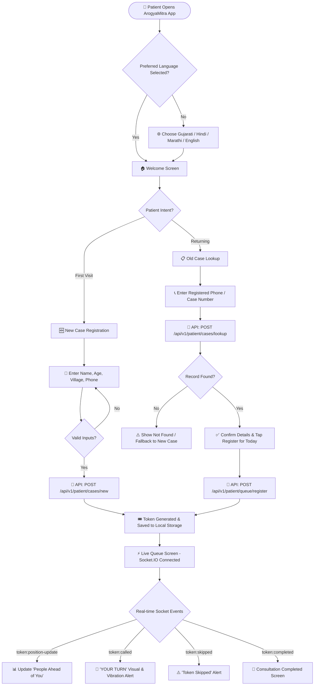
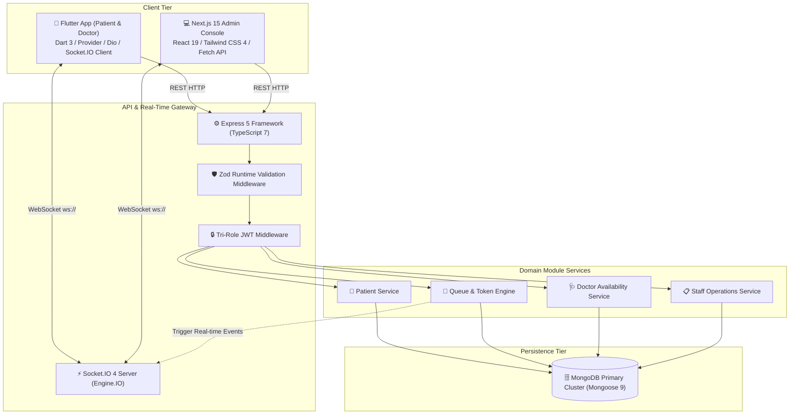
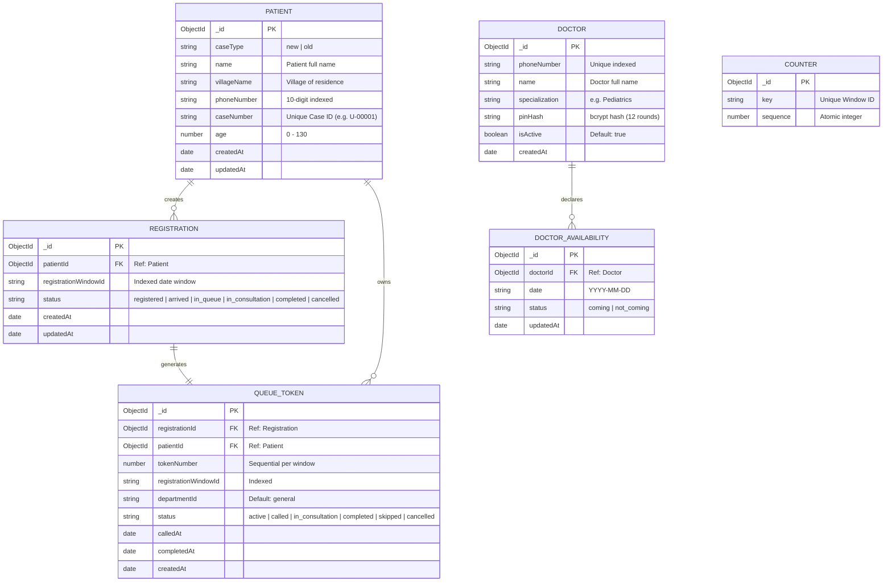
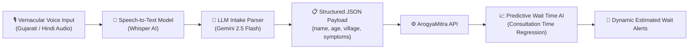

# 📘 AROGYAMITRA — COMPREHENSIVE PROJECT SPECIFICATION (PROJECT SPEC)
**System Name:** ArogyaMitra (NextGen Hospital OPD Queue, Patient Registration & Doctor Management Platform)  
**Organization / Target:** Shri Satya Sai Gramya Arogya Mandir  
**Document Type:** Full Lifecycle Product, Technical, Architectural & Quality Specification  
**Version:** 2.0.0 | **Author:** Enterprise Technology Architecture Group  

---

```
PROJECT SPEC
│
├── 01_PRODUCT
│   ├── PRD
│   ├── User Stories
│   └── User Flows
│
├── 02_DESIGN
│   ├── UI/UX
│   ├── Design System
│   └── Screen Specifications
│
├── 03_TECHNICAL
│   ├── TRD
│   ├── Architecture
│   ├── Database Schema
│   ├── API Specification
│   └── Component Architecture
│
├── 04_BEHAVIOR
│   ├── Business Logic
│   ├── AI/LLM Specification
│   ├── State Management
│   └── Edge Cases
│
└── 05_QUALITY
    ├── Security
    ├── Testing
    ├── Performance
    ├── Deployment
    └── Documentation
```

---

# 01_PRODUCT

## 1.1 PRD (Product Requirements Document)

### Vision & Mission
**Vision:** Ensure zero-wait, transparent, and dignified healthcare access for rural communities through inclusive mobile and web technology.  
**Mission:** Provide an omni-channel, multilingual OPD queuing, doctor schedule coordination, and patient record tracking ecosystem for **Shri Satya Sai Gramya Arogya Mandir**.

### Target Audience & Personas
1. **Rural Patient & Family (Primary Consumer)**:
   - Limited digital literacy, speaks local dialects (Gujarati, Hindi, Marathi), travels from surrounding villages.
   - *Needs:* Simple UI, native language options, real-time token tracking so they don't wait in overcrowded physical lines.
2. **Visiting Physician / Specialist (Clinical Provider)**:
   - Travels from urban medical centers on designated OPD days (e.g., weekends).
   - *Needs:* Quick mobile portal to declare availability (Coming / Not Coming) without administrative bureaucracy.
3. **Hospital Staff / Receptionist / Triage Nurse (Operator)**:
   - High-stress desk handling hundreds of walk-in consultations.
   - *Needs:* Real-time live queue board, instant search by phone/case number, one-click patient calling, and reliable queue advancement.

### Core Objectives & Success Metrics (KPIs)
- **Queue Transparency:** 100% of registered patients receive a verifiable digital token with real-time queue position.
- **Crowd Reduction:** Reduce physical OPD waiting room congestion by >65% via remote tracking.
- **Doctor Attendance Predictability:** Capture 100% of visiting doctors' availability 48 hours prior to OPD window opening.
- **Registration Speed:** Sub-30-second registration time for both new and returning patients.

---

## 1.2 User Stories

### Patient Module
- **US-P01 (Language Preference):** *As a rural patient*, I want to select my native language (Gujarati, Hindi, Marathi, English) on launch, so that I can easily navigate the registration process without assistance.
- **US-P02 (New Registration):** *As a first-time patient*, I want to register with my Name, Age, Phone Number, and Village, so that I receive a unique Case ID and live OPD token number.
- **US-P03 (Returning Registration):** *As a returning patient*, I want to enter my phone number or Case ID, so that the system retrieves my records and registers me for today's queue in one tap.
- **US-P04 (Live Queue Position):** *As a registered patient*, I want to see how many people are ahead of me in real time, so that I can estimate when to arrive at the consultation room.
- **US-P05 (Turn Notification):** *As a waiting patient*, I want my app to alert me with "YOUR TURN!" when the hospital calls my token, so that I don't miss my consultation.

### Doctor Module
- **US-D01 (Doctor Login):** *As a visiting doctor*, I want to log in using my phone number and 6-digit PIN, so that I can securely manage my clinic schedule.
- **US-D02 (Availability Toggle):** *As a doctor*, I want to view upcoming OPD dates and toggle my availability between "Coming" and "Not Coming", so that hospital administration can plan patient volume accordingly.

### Hospital Staff / Admin Module
- **US-A01 (Staff Login):** *As a hospital administrator*, I want to log in via a PIN-secured web dashboard, so that unauthorized persons cannot alter the patient queue.
- **US-A02 (Live Queue Dispatcher):** *As a staff member*, I want to see the live queue and click **Call Next**, **Skip**, or **Complete**, so that the physical queue advances smoothly.
- **US-A03 (Patient Directory & Search):** *As a staff member*, I want to search past patient records by name, phone number, or Case ID, so that I can view their visit history and re-register them if needed.
- **US-A04 (Doctor Roster Management):** *As an administrator*, I want to create doctor profiles, set initial PINs, and review their declared availability status for upcoming dates.

---

## 1.3 User Flows



---

# 02_DESIGN

## 2.1 UI/UX Philosophy
- **High Inclusivity & Legibility:** Minimum text size of 16px, large tap targets (≥ 56px height) suited for elderly rural users and one-handed mobile usage.
- **Visual & Non-Text Cues:** Rich emoji badges (🆕, 📋, 🎟️, 🩺) alongside text labels to assist low-literacy users.
- **Zero-Poll Refreshing:** Real-time socket synchronization gives instant feedback with smooth state transitions, eliminating user confusion regarding manual screen refreshing.

---

## 2.2 Design System

### Color Palette Tokens
| Token Name | HEX Code | Purpose & Semantic Meaning |
| :--- | :--- | :--- |
| `primary` | `#00897B` | Deep Teal — Primary actions, brand identification, medical reliability. |
| `primaryDark` | `#004D40` | Dark Teal — Headings, high-contrast text, active states. |
| `surface` | `#FFFFFF` | Card containers, input surfaces, modal sheets. |
| `background` | `#F4FBF7` | Soft mint tinted background for reduced eye fatigue. |
| `yourTurn` | `#2E7D32` | Forest Green — Prominent "IT'S YOUR TURN" status badge. |
| `amberWarning` | `#F57F17` | Warning state — "Almost Your Turn" / 1-2 people ahead. |
| `danger` | `#C62828` | Skipped, cancelled, or destructive actions. |
| `textPrimary` | `#1A202C` | Core typography color (high contrast). |
| `textSecondary` | `#5A6A80` | Subtitles, helper text, and secondary metadata. |

### Typography Scale
- **Display 1 (Welcome Title):** 32px / Bold (Weight 900), tracking -0.5px.
- **Heading 1 (Screen Titles):** 22px / Bold (Weight 700).
- **Body Large (Inputs / Buttons):** 16px / SemiBold (Weight 600).
- **Body Regular (Descriptions):** 14px / Regular (Weight 400), line height 1.4.
- **Caption / Meta:** 12px / Medium (Weight 500).

---

## 2.3 Screen Specifications

### Mobile Application (Flutter)
1. **`WelcomeScreen`**:
   - Header with `assets/images/logo.png`, app title `ArogyaMitra`, and Doctor login stethoscope icon.
   - Dynamic Active Token Card (if user holds an active session token).
   - "New Case" (🆕) and "Old Case" (📋) selection cards.
   - Bottom floating language switcher banner (ગુજરાતી • हिन्दी • English).
2. **`NewCaseScreen`**:
   - Form fields: Full Name, Age (numeric validation 0-130), Village Name, 10-digit Phone number.
   - Primary action: "REGISTER & GET TOKEN".
3. **`OldCaseScreen`**:
   - Phone number input with auto-formatting.
   - Search result list of matching family members/records.
   - "Register for Today's OPD" button.
4. **`MyTokenScreen`**:
   - Large circular token number badge.
   - Real-time status indicator: "Please Wait" (Blue) ➔ "Your turn is near" (Amber) ➔ "YOUR TURN!" (Flashing Green) ➔ "Completed" (Teal).
   - Live count: "People before you: X".
5. **`DoctorLoginScreen` & `DoctorAvailabilityScreen`**:
   - Phone + 6-digit numeric PIN entry.
   - Date picker displaying upcoming weekend OPD clinics with toggle switch: [COMING] / [NOT COMING].

### Web Admin Dashboard (Next.js 15)
1. **`StaffLogin` (`/`)**: Centered card with brand logo, 4-digit staff PIN input (`1234`), and JWT session generator.
2. **`QueueBoard`**: Real-time matrix of active tokens separated into "Waiting", "In Consultation", and "Skipped" with Call/Skip/Complete controls.
3. **`RegistrationsList`**: Data table of all session registrations with date/window filters and status controls.
4. **`PatientsView`**: Full-text search engine across patient names, phone numbers, and case numbers.
5. **`DoctorsView`**: Add Doctor modal, PIN reset tool, active status toggle, and declared availability timeline.

---

# 03_TECHNICAL

## 3.1 TRD (Technical Requirements Document)
- **Target OS / Environment:**
  - Backend: Node.js ≥ 20.x, Linux/Windows/Docker container.
  - Web Admin: Modern evergreen browsers (Chrome, Edge, Safari, Firefox).
  - Mobile App: Android 6.0+ (API 23+) & iOS 14.0+.
- **Performance Service Level Objectives (SLOs):**
  - WebSocket token dispatch latency: < 100ms.
  - REST API response time (p95): < 150ms.
  - Client cold start time: < 1.5 seconds.
- **Concurrency & Throughput:** Support 500 simultaneous active socket connections per hospital instance on single core.

---

## 3.2 System Architecture Topology



---

## 3.3 Database Schema (Mongoose 9 Collections)



---

## 3.4 API Specification

### Patient Endpoints (`/api/v1/patient`)
| Method | Route | Auth | Payload Summary | Response Summary |
| :--- | :--- | :--- | :--- | :--- |
| `POST` | `/cases/new` | None | `{ name, villageName, phoneNumber, age }` | `{ success: true, data: { patient, registration, token } }` |
| `POST` | `/cases/lookup` | None | `{ phoneNumber, caseNumber? }` | `{ success: true, data: { patients: [...] } }` |
| `POST` | `/queue/register` | None | `{ patientId, departmentId? }` | `{ success: true, data: { token, registration } }` |
| `GET` | `/token` | Session JWT | Header: `Authorization: Bearer <session>` | `{ success: true, data: { token, position, totalAhead } }` |
| `GET` | `/queue/status` | None | Query: `?windowId=...` | `{ success: true, data: { currentToken, totalActive } }` |

### Doctor Endpoints (`/api/doctors`)
| Method | Route | Auth | Payload Summary | Response Summary |
| :--- | :--- | :--- | :--- | :--- |
| `POST` | `/login` | None | `{ phoneNumber, pin }` | `{ success: true, token: "JWT...", doctor: {...} }` |
| `GET` | `/me` | Doctor JWT | — | `{ success: true, data: { doctor } }` |
| `GET` | `/availability` | Doctor JWT | Query: `?startDate=&endDate=` | `{ success: true, data: [ { date, status } ] }` |
| `POST` | `/availability` | Doctor JWT | `{ date: "YYYY-MM-DD", status: "coming"|"not_coming" }` | `{ success: true, data: { availabilityRecord } }` |

### Admin Endpoints (`/api/admin`)
| Method | Route | Auth | Purpose |
| :--- | :--- | :--- | :--- |
| `POST` | `/login` | None | Verify 4-digit staff PIN (`1234`) & issue Admin JWT. |
| `GET` | `/queue/live` | Admin JWT | Retrieve live queue list for current OPD window. |
| `POST` | `/queue/:id/call-next` | Admin JWT | Advance token to `called` & trigger `token:called` event. |
| `POST` | `/queue/:id/skip` | Admin JWT | Set token to `skipped` & notify patient. |
| `POST` | `/queue/:id/complete` | Admin JWT | Set token to `completed` and advance queue. |
| `GET` | `/patients` | Admin JWT | Fuzzy search patient directory. |
| `POST` | `/doctors` | Admin JWT | Create doctor account and assign initial PIN. |
| `PATCH` | `/doctors/:id/pin` | Admin JWT | Reset doctor PIN. |
| `GET` | `/doctors/availability` | Admin JWT | View all doctors' declared attendance for an OPD date. |

---

# 04_BEHAVIOR

## 4.1 Business Logic & Lifecycle Rules

### 1. Atomic Sequence Number Generation
To guarantee that no two patients receive duplicate token numbers even during high-concurrency registration spikes:
```typescript
const counter = await Counter.findOneAndUpdate(
  { key: registrationWindowId },
  { $inc: { sequence: 1 } },
  { returnDocument: 'after', upsert: true }
);
const tokenNumber = counter.sequence;
```

### 2. Time-Window Enforcement
- Registrations are constrained by a weekly schedule (e.g., Saturday 06:00 to Sunday 06:00).
- When `ALLOW_24_7_REGISTRATION=true` is set in `.env`, the system constructs an ephemeral daily window (`daily_YYYY-MM-DD`) to enable 24/7 testing and emergency clinic sessions.

---

## 4.2 AI / LLM Extension Blueprint

To further empower rural patients and optimize hospital operations, the system is architected to support future AI additions:



1. **Voice-to-Registration Intake:** Patients speak their details in their native village dialect; LLM extracts `{ name, age, village, phone }` to auto-fill the form.
2. **Predictive Wait-Time Engine:** ML model analyzes historical consultation durations per doctor specialization to forecast accurate appointment arrival windows.

---

## 4.3 State Management

- **Flutter Client:**
  - `Provider` pattern for global state (`DoctorProvider`, `LocaleProvider`).
  - `SessionStorage` backed by encrypted `SharedPreferences` for token persistence across app restarts.
- **Next.js Admin Console:**
  - React State + WebSocket event listeners (`socket.on('queue:updated')`) triggering optimistic UI updates.

---

## 4.4 Edge Cases & Failure Mitigation

| Failure Scenario | System Reaction & Recovery Protocol |
| :--- | :--- |
| **Mobile network loss during queue call** | Token status is persisted in MongoDB; when patient app reconnects, `join:patient` automatically resynchronizes current token status and presents the "YOUR TURN" modal. |
| **Simultaneous patient registration race** | MongoDB atomic `$inc` prevents collision; both get sequential numbers (e.g., 21 and 22). |
| **Patient leaves hospital unexpectedly** | Admin clicks "Skip", token moves to skipped holding list without breaking sequence for subsequent patients. |
| **Wrong phone number entered on old case** | Lookup returns 404 with friendly fallback message encouraging new case registration or desk inquiry. |

---

# 05_QUALITY

## 5.1 Security Architecture
- **Tri-Tier JWT Isolation:**
  - `ADMIN_JWT_SECRET`: Signs admin tokens with 24-hour expiration.
  - `DOCTOR_JWT_SECRET`: Signs doctor tokens (`role: 'doctor'`) with 7-day expiration.
  - `PATIENT_JWT_SECRET`: Signs ephemeral patient session tokens (48-hour lifespan).
- **Password Security:** Doctor PINs hashed with `bcrypt` using 12 salt rounds.
- **Input Sanitization:** 100% of API inputs pass through strict Zod schemas rejecting unmapped fields.

---

## 5.2 Testing Strategy

```mermaid
pyramid
    title Testing Pyramid
    "E2E Testing (Flutter Driver / Cypress)" : 15
    "API & Integration Tests (Supertest / Jest / In-Memory Mongo)" : 35
    "Unit Tests (Validators / Schema / Utilities / Widgets)" : 50
```

- **Unit Tests:** Validate Zod schemas, date window calculations, and state reducers.
- **Integration Tests:** Test full registration-to-token dispatch flows using Supertest and in-memory MongoDB.
- **Real-Time Tests:** Verify WebSocket event emissions and room broadcasting assertions.

---

## 5.3 Performance & Optimization
- **Database Indexing:** Compound indexes on `{ phoneNumber: 1, caseNumber: 1 }` and `{ registrationWindowId: 1, status: 1 }`.
- **Fast Startup:** Next.js 15 Turbopack bundling for instant page loads.
- **Flutter Impeller Engine:** Hardware-accelerated Vulkan rendering pipeline delivering solid 60/120 fps.

---

## 5.4 Deployment & Infrastructure Topology

| Tier | Component | Recommended Production Platform |
| :--- | :--- | :--- |
| **Database** | MongoDB 6+ | MongoDB Atlas (M10+ with automated daily backups) |
| **Backend API** | Express 5 + Socket.IO | Render / Railway / AWS ECS (Persistent Node.js container) |
| **Admin Web App** | Next.js 15 | Vercel (Edge network deployment) |
| **Mobile App** | Flutter 3.x | Google Play Store / Apple App Store release APK & IPA |

---

## 5.5 Maintenance & Operational Runbook

### Key Health Endpoints
- `GET /health` ➔ Returns `{ status: "ok", timestamp: "...", uptime: 1234 }`

### Environment Configuration Checklist (`.env`)
```env
MONGODB_URI=mongodb://localhost:27017/hospital-queue
PORT=4000
NODE_ENV=production
ADMIN_JWT_SECRET=production_admin_jwt_secret_key_random
PATIENT_JWT_SECRET=production_patient_session_secret_key_random
DOCTOR_JWT_SECRET=production_doctor_jwt_secret_key_random
CORS_ORIGIN_PATIENT=http://localhost:3000
CORS_ORIGIN_ADMIN=http://localhost:3001
HOSPITAL_NAME=ArogyaMitra
TIMEZONE=Asia/Kolkata
ALLOW_24_7_REGISTRATION=true
```

---
*End of ArogyaMitra Project Specification Document.*
