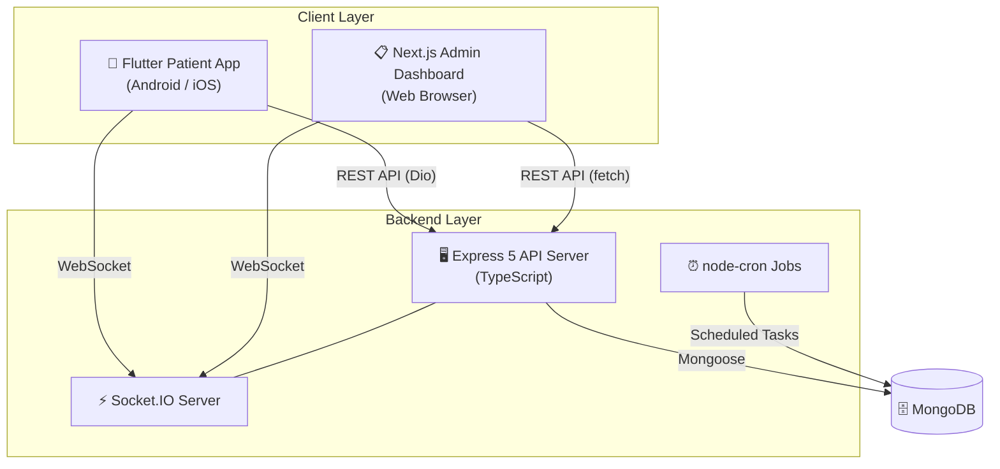

# 🏥 NextGen Hospital OPD Queue & Registration System

<div align="center">
  
  
  
  
  
  
  
</div>

<br />

> A real-time OPD (Outpatient Department) queue management and patient registration system built for **Shri Satya Sai Gramya Arogya Mandir**. Patients register via a mobile app, receive a live queue token, and hospital staff manage the queue from a web dashboard — all synchronized in real-time via WebSockets.

---

## ✨ Key Features

- **⚡ Real-Time Queue Board** — Live queue updates across all patient and staff screens via Socket.IO. No polling, no refreshing.
- **📱 Flutter Patient App** — Native Android/iOS app for patients to register (new or returning), view their token, and track queue position in real-time. Supports **Marathi + English** localization.
- **📋 Admin Dashboard** — Secure Next.js web portal for hospital staff to manage the queue: **Call Next**, **Skip**, **Complete** patients. View registrations, search patients, and see stats.
- **🔒 PIN-Based Authentication** — Staff login is protected by a PIN + JWT token system. All admin endpoints require valid authentication.
- **🕒 Registration Windows** — Configurable time-restricted registration (e.g., Saturday 06:00 to Sunday 06:00). Can be disabled for 24/7 testing.
- **📇 Patient Directory** — Full CRUD on patient records with search by name, phone, or case number. Patient stats and re-registration support.
- **🔢 Auto-Incrementing Tokens** — Unique token numbers generated per registration window using an atomic counter.
- **📊 Zod Validation** — Request payloads validated at the API layer using Zod schemas.
- **📝 Structured Logging** — Production-grade logging with Pino.

---

## 🛠️ Tech Stack

| Layer              | Technology                                               |
| :----------------- | :------------------------------------------------------- |
| **Backend API**    | Node.js, Express 5, TypeScript 7, Zod 4                 |
| **Database**       | MongoDB (Mongoose 9)                                     |
| **Real-time**      | Socket.IO 4                                              |
| **Admin Dashboard**| Next.js 15, React 19, Tailwind CSS 4                    |
| **Patient App**    | Flutter (Dart 3), Provider, Dio, socket_io_client        |
| **Background Jobs**| node-cron                                                |
| **Logging**        | Pino + pino-pretty                                       |
| **Auth**           | JWT (jsonwebtoken)                                       |
| **Validation**     | Zod (backend), Flutter form validation (mobile)          |

---

## 🏗️ Architecture Overview



**How it works:**
1. **Patient** opens the Flutter app → registers as new or returning patient → receives a queue token.
2. **Socket.IO** broadcasts the new registration and token to the admin dashboard in real-time.
3. **Staff** views the live queue on the admin dashboard → clicks "Call Next" to call the next patient.
4. **Socket.IO** notifies the patient's app that their token has been called.
5. Staff marks the consultation as "Complete" or "Skip", and the queue automatically advances.

---

## 📁 Project Structure

```
Hospital/
├── .gitignore                          # Unified gitignore for entire monorepo
├── README.md                           # ← You are here
├── start.bat                           # Windows one-click launcher for all services
│
├── hospital-api-server/                # 🖥️ Backend API (TypeScript + Express)
│   ├── package.json
│   ├── tsconfig.json
│   ├── .env                            # Environment variables (not committed)
│   └── src/
│       ├── app.ts                      # Express app factory (routes, middleware, CORS)
│       ├── server.ts                   # Entry point (DB connect, Socket.IO init, listen)
│       ├── config/
│       │   ├── database.ts             # MongoDB connection logic
│       │   └── env.ts                  # Environment variable loader + defaults
│       ├── infrastructure/
│       │   └── socket/
│       │       ├── socketServer.ts     # Socket.IO server setup & room management
│       │       ├── events.ts           # Socket event name constants
│       │       └── notifier.ts         # Helper to emit socket events from controllers
│       ├── middleware/
│       │   ├── auth.ts                 # JWT authentication middleware
│       │   ├── errorHandler.ts         # Centralized error handler
│       │   ├── validate.ts             # Zod schema validation middleware
│       │   └── validateRegistrationWindow.ts  # Time-window enforcement
│       ├── models/
│       │   ├── Patient.ts              # Patient schema (name, phone, village, case#)
│       │   ├── Registration.ts         # Registration schema (patient + window + status)
│       │   ├── QueueToken.ts           # Queue token schema (token#, status lifecycle)
│       │   └── Counter.ts             # Auto-increment counter for token numbers
│       ├── modules/
│       │   ├── patients/               # Patient-facing feature module
│       │   │   ├── patient.controller.ts
│       │   │   ├── patient.routes.ts
│       │   │   ├── patient.schemas.ts  # Zod schemas for request validation
│       │   │   └── patient.dto.ts      # Data transfer object types
│       │   ├── staff/                  # Staff/admin feature module
│       │   │   ├── staff.controller.ts
│       │   │   └── staff.routes.ts
│       │   └── tokens/                 # Token/queue service module
│       │       ├── token.service.ts
│       │       └── queue.service.ts
│       ├── types/
│       │   └── index.ts               # Shared TypeScript interfaces
│       └── utils/
│           ├── AppError.ts             # Custom error class
│           ├── apiResponse.ts          # Standardized API response helper
│           ├── logger.ts               # Pino logger configuration
│           └── session.ts              # Session utilities
│
├── hospital-admin-app/                 # 📋 Staff Admin Dashboard (Next.js)
│   ├── package.json
│   ├── tsconfig.json
│   ├── next.config.ts
│   ├── postcss.config.mjs
│   ├── app/
│   │   ├── layout.tsx                  # Root layout
│   │   ├── page.tsx                    # Dashboard home (login + queue board)
│   │   ├── globals.css                 # Global styles
│   │   └── registrations/             # Registrations management page
│   ├── components/
│   │   ├── QueueBoard.tsx             # Live queue display with Call/Skip/Complete
│   │   ├── PatientsView.tsx           # Patient directory with search
│   │   ├── PatientCard.tsx            # Individual patient card
│   │   ├── PatientDetails.tsx         # Patient detail view
│   │   └── RegistrationsList.tsx      # Registration list display
│   └── lib/                           # API client helpers and utilities
│
├── hospital_patient_app/               # 📱 Patient Mobile App (Flutter)
│   ├── pubspec.yaml                    # Flutter dependencies
│   ├── analysis_options.yaml
│   ├── android/                        # Android platform files
│   ├── ios/                            # iOS platform files
│   └── lib/
│       ├── main.dart                   # App entry point
│       ├── core/
│       │   ├── constants/             # App-wide constants (API URLs, etc.)
│       │   ├── localization/          # l10n support
│       │   ├── models/               # Dart data models
│       │   ├── navigation/           # Route/navigation config
│       │   ├── network/              # Dio HTTP client setup
│       │   ├── socket/               # Socket.IO client
│       │   ├── storage/              # SharedPreferences wrappers
│       │   └── theme/                # App theme and colors
│       ├── features/
│       │   ├── onboarding/           # Welcome / language selection
│       │   ├── new_case/             # New patient registration flow
│       │   ├── old_case/             # Returning patient lookup flow
│       │   ├── token/                # Token status & live queue position
│       │   └── help/                 # Help / instructions
│       ├── shared/                    # Shared widgets
│       └── l10n/                      # Localization files (en, mr)
```

---

## 🗄️ Database Schema

The backend uses **4 MongoDB collections**:

### Patient
Stores the master record for each patient.

| Field         | Type     | Description                            |
| :------------ | :------- | :------------------------------------- |
| `caseType`    | String   | `"new"` or `"old"`                     |
| `name`        | String   | Patient's full name                    |
| `villageName` | String   | Village name                           |
| `phoneNumber` | String   | Phone number (indexed for lookups)     |
| `caseNumber`  | String   | Unique case number (indexed)           |
| `age`         | Number   | Patient's age (0–150)                  |
| `createdAt`   | Date     | Auto-generated timestamp               |

### Registration
Links a patient to a specific registration window (e.g., a Saturday OPD session).

| Field                  | Type     | Description                                       |
| :--------------------- | :------- | :------------------------------------------------ |
| `patientId`            | ObjectId | Reference to Patient                              |
| `registrationWindowId` | String   | Identifier for the time window (indexed)          |
| `status`               | String   | `registered` → `arrived` → `in_queue` → `in_consultation` → `completed` / `cancelled` |

### QueueToken
Represents a patient's position in the queue for a given session.

| Field                  | Type     | Description                                       |
| :--------------------- | :------- | :------------------------------------------------ |
| `registrationId`       | ObjectId | Reference to Registration                         |
| `patientId`            | ObjectId | Reference to Patient                              |
| `tokenNumber`          | Number   | Sequential token number for this window           |
| `registrationWindowId` | String   | Which session this token belongs to               |
| `departmentId`         | String   | Department (default: `"general"`)                 |
| `status`               | String   | `active` → `called` → `in_consultation` → `completed` / `skipped` / `cancelled` |
| `calledAt`             | Date     | When the token was called                         |
| `completedAt`          | Date     | When consultation finished                        |

### Counter
Atomic auto-increment counter used to generate unique token numbers per session.

| Field      | Type   | Description                               |
| :--------- | :----- | :---------------------------------------- |
| `key`      | String | Registration window ID (unique)           |
| `sequence` | Number | Current counter value                     |

---

## 📡 API Reference

### Health Check

| Method | Endpoint  | Description                    |
| :----- | :-------- | :----------------------------- |
| GET    | `/health` | Returns server status and info |

---

### Patient Routes — `/api/v1/patient`

> These endpoints are used by the Flutter patient app. Also available at `/api/registrations` for backwards compatibility.

| Method | Endpoint          | Description                                  |
| :----- | :---------------- | :------------------------------------------- |
| POST   | `/cases/new`      | Register a new patient (name, phone, village, age) and generate a queue token |
| POST   | `/cases/lookup`   | Look up an existing patient by phone number  |
| POST   | `/queue/register` | Register a returning patient for today's queue and generate a token |
| GET    | `/token`          | Get the current token status for a patient   |
| GET    | `/queue/status`   | Get hospital-wide queue status (total tokens, current position, etc.) |

> **Note:** `POST /cases/new` and `POST /queue/register` are gated by the registration window middleware.

---

### Staff Routes — `/api/admin`

> All routes except `/login` require a valid JWT token in the `Authorization: Bearer <token>` header.

| Method | Endpoint                       | Auth | Description                          |
| :----- | :----------------------------- | :--- | :----------------------------------- |
| POST   | `/login`                       | ❌   | Staff login with PIN code            |
| GET    | `/queue/live`                  | ✅   | Get the live queue for current window |
| POST   | `/queue/:tokenId/call-next`    | ✅   | Call the next patient in queue       |
| POST   | `/queue/:tokenId/skip`         | ✅   | Skip a patient                       |
| POST   | `/queue/:tokenId/complete`     | ✅   | Mark a consultation as complete      |
| GET    | `/registrations`               | ✅   | List all registrations               |
| PATCH  | `/registrations/:id`           | ✅   | Update a registration                |
| DELETE | `/registrations/:id`           | ✅   | Delete a registration                |
| GET    | `/patients`                    | ✅   | Search patient directory             |
| GET    | `/patients/stats`              | ✅   | Get patient statistics               |
| GET    | `/patients/:id`                | ✅   | Get a specific patient by ID         |
| PATCH  | `/patients/:id`                | ✅   | Update patient details               |
| POST   | `/patients/:id/register-again` | ✅   | Re-register a patient for a new session |

---

### Socket.IO Events

Real-time events that keep the patient app and admin dashboard in sync.

| Event                   | Direction        | Description                                      |
| :---------------------- | :--------------- | :----------------------------------------------- |
| `join:admin`            | Client → Server  | Staff client joins the admin room                |
| `join:patient`          | Client → Server  | Patient client joins their personal room (by registrationId or tokenId) |
| `registration:created`  | Server → Admin   | A new patient registration was created           |
| `queue:new-token`       | Server → Admin   | A new queue token was generated                  |
| `queue:updated`         | Server → All     | Queue state has changed (call, skip, complete)   |
| `queue:paused`          | Server → Admin   | Queue has been paused                            |
| `token:called`          | Server → Patient | The patient's token number has been called       |
| `token:position-update` | Server → Patient | Patient's position in the queue has changed      |
| `token:completed`       | Server → Patient | The patient's consultation is complete           |
| `token:cancelled`       | Server → Patient | The patient's token was cancelled                |
| `token:skipped`         | Server → Patient | The patient's token was skipped                  |

---

## ⚙️ Prerequisites

Before you begin, make sure you have these installed:

| Tool     | Version | Download                                                 |
| :------- | :------ | :------------------------------------------------------- |
| Node.js  | ≥ 18    | [nodejs.org](https://nodejs.org/)                        |
| npm      | ≥ 9     | Comes with Node.js                                       |
| MongoDB  | ≥ 6     | [mongodb.com](https://www.mongodb.com/) or use Atlas     |
| Flutter  | ≥ 3.0   | [flutter.dev](https://flutter.dev/docs/get-started/install) |

---

## 🚀 Quick Start (Windows)

A one-click launcher is provided for Windows users:

```cmd
.\start.bat
```

This batch script will:
1. ✅ Check if MongoDB service is running (auto-starts if possible)
2. ✅ Verify the `.env` file exists for the API server
3. ✅ Spawn **3 separate terminal windows**:
   - **API Server** — `http://localhost:4000` (Node.js)
   - **Admin Dashboard** — `http://localhost:3001` (Next.js)
   - **Patient App** — Flutter running on a connected device/emulator
4. ✅ Auto-open the Admin Dashboard in your browser after 4 seconds

> **Default Staff PIN:** `1234`

---

## 🛠️ Manual Setup (Cross-Platform)

### 1. Clone the Repository

```bash
git clone https://github.com/Vihangpatil37/Hospital-management.git
cd Hospital-management
```

### 2. Setup Backend API

```bash
cd hospital-api-server
cp .env.example .env          # Create env file and fill in your values
npm install                   # Install dependencies
npm run build                 # Compile TypeScript → JavaScript
npm start                     # Start server on http://localhost:4000
```

### 3. Setup Admin Dashboard

```bash
cd hospital-admin-app
npm install                   # Install dependencies
npm run dev                   # Start dev server on http://localhost:3001
```

### 4. Setup Patient App (Flutter)

```bash
cd hospital_patient_app
flutter pub get               # Install dependencies
flutter run                   # Run on connected device or emulator
```

---

## 🔐 Environment Variables

Create a `.env` file inside `hospital-api-server/` with the following:

```env
# Database
MONGODB_URI=mongodb://localhost:27017/hospital-queue

# Server
PORT=4000
NODE_ENV=development

# Authentication
ADMIN_JWT_SECRET=your_admin_jwt_secret_key
PATIENT_JWT_SECRET=your_patient_session_secret_key

# CORS Origins
CORS_ORIGIN_PATIENT=http://localhost:3000
CORS_ORIGIN_ADMIN=http://localhost:3001

# Hospital Configuration
HOSPITAL_NAME=Shri Satya sai gramya arogya mandir
TIMEZONE=Asia/Kolkata
ALLOW_24_7_REGISTRATION=true
```

| Variable                  | Required | Default                              | Description                        |
| :------------------------ | :------- | :----------------------------------- | :--------------------------------- |
| `MONGODB_URI`             | ✅       | `mongodb://localhost:27017/hospital-queue` | MongoDB connection string    |
| `PORT`                    | ❌       | `4000`                               | API server port                    |
| `ADMIN_JWT_SECRET`        | ✅       | —                                    | Secret key for staff JWT tokens    |
| `PATIENT_JWT_SECRET`      | ✅       | —                                    | Secret key for patient sessions    |
| `CORS_ORIGIN_PATIENT`     | ❌       | `http://localhost:3000`              | Allowed origin for patient app     |
| `CORS_ORIGIN_ADMIN`       | ❌       | `http://localhost:3001`              | Allowed origin for admin dashboard |
| `HOSPITAL_NAME`           | ❌       | `Shri Satya sai gramya arogya mandir` | Hospital display name            |
| `TIMEZONE`                | ❌       | `Asia/Kolkata`                       | Timezone for registration windows  |
| `ALLOW_24_7_REGISTRATION` | ❌       | `true`                               | Bypass time-window restrictions    |

---

## 🚢 Deployment

### Database
- **MongoDB Atlas** (Free Tier or Dedicated) is recommended for production.

### Backend API
Deploy to a **persistent server** that supports WebSocket connections:
- ✅ **Railway**, **Render**, or **Fly.io**
- ❌ **Vercel / Netlify** — These are serverless platforms and **cannot** maintain the persistent TCP connections required by Socket.IO or run continuous `node-cron` processes.

### Admin Dashboard
- The Next.js admin app deploys seamlessly to **Vercel**.

### Patient App
- Build a release APK/AAB:
  ```bash
  cd hospital_patient_app
  flutter build apk --release
  ```
- Distribute via the Google Play Store, Firebase App Distribution, or direct APK sharing.

---

## 🤝 Contributing

Contributions are welcome! Here's how to get started:

1. **Fork** this repository
2. **Create** a feature branch: `git checkout -b feature/your-feature-name`
3. **Commit** your changes: `git commit -m "feat: add your feature description"`
4. **Push** to your branch: `git push origin feature/your-feature-name`
5. **Open** a Pull Request

Please follow the existing code structure and naming conventions.

---

## 📄 License

Distributed under the **MIT License**. See `LICENSE` for more information.

---

<div align="center">
  <p>Built with ❤️ for <strong>Shri Satya Sai Gramya Arogya Mandir</strong></p>
</div>