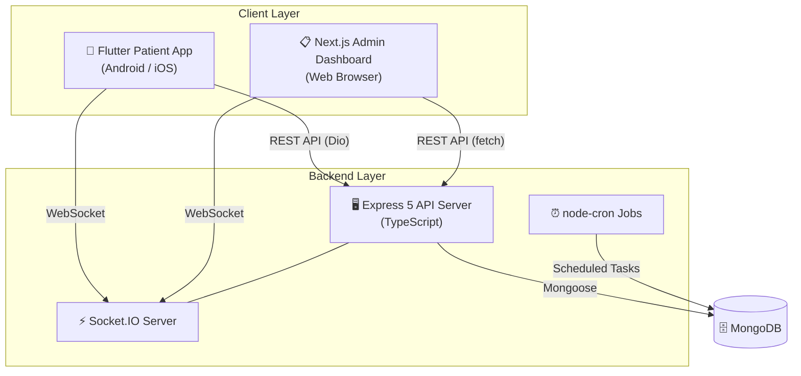

# 🏥 NextGen Hospital OPD Queue & Registration System

<div align="center">
  
  
  
  
  
  
  
</div>

<br />

> A real-time OPD (Outpatient Department) queue management and patient registration system built for **Shri Satya Sai Gramya Arogya Mandir**. Patients register via a mobile app, receive a live queue token, and hospital staff manage the queue from a web dashboard — all synchronized in real-time via WebSockets.

---

## ✨ Key Features

- **⚡ Real-Time Queue Board** — Live queue updates across all patient and staff screens via Socket.IO. No polling, no refreshing.
- **📱 Flutter Patient App** — Native Android/iOS app for patients to register (new or returning), view their token, and track queue position in real-time. Supports **Gujarati**, **Hindi**, and **English** localization.
- **📋 Admin Dashboard** — Secure Next.js web portal for hospital staff to manage the queue: **Call Next**, **Skip**, **Complete** patients. View registrations, search patients, manage doctors, and see stats.
- **👨‍⚕️ Doctor Module** — Doctors log in via the patient app with phone + PIN, set their daily availability (Coming / Not Coming), and are visible on the admin dashboard.
- **🔒 Role-Based Authentication** — Three separate JWT-based auth flows: Staff (PIN + 8h JWT), Patient (session + 24h JWT), and Doctor (phone + PIN + 24h JWT with bcrypt hashing).
- **🕒 Registration Windows** — Configurable time-restricted registration (e.g., Saturday 06:00 to Sunday 06:00). Can be disabled for 24/7 operation.
- **📇 Patient Directory** — Full CRUD on patient records with search by name, phone, village, or case number. Patient stats and re-registration support.
- **🔢 Auto-Incrementing Tokens** — Unique token numbers generated per registration window using an atomic counter.
- **📊 Zod Validation** — Request payloads validated at the API layer using Zod schemas.
- **📝 Structured Logging** — Production-grade logging with Pino.

---

## 🛠️ Tech Stack

| Layer               | Technology                                               |
| :------------------ | :------------------------------------------------------- |
| **Backend API**     | Node.js, Express 5, TypeScript 7, Zod 4                 |
| **Database**        | MongoDB (Mongoose 9)                                     |
| **Real-time**       | Socket.IO 4                                              |
| **Admin Dashboard** | Next.js 15, React 19, Tailwind CSS 4, Lucide React      |
| **Patient App**     | Flutter (Dart ≥3.0), Provider, Dio, socket_io_client     |
| **Background Jobs** | node-cron                                                |
| **Logging**         | Pino + pino-pretty                                       |
| **Auth**            | JWT (jsonwebtoken) + bcrypt (doctor PINs)                |
| **Validation**      | Zod (backend), Flutter form validation (mobile)          |
| **Date/Time**       | Luxon                                                    |

---

## 🏗️ Architecture Overview



**How it works:**
1. **Patient** opens the Flutter app → selects language (Gujarati/Hindi/English) → registers as new or returning patient → receives a queue token.
2. **Socket.IO** broadcasts the new registration and token to the admin dashboard in real-time.
3. **Staff** views the live queue on the admin dashboard → clicks "Call Next" to call the next patient.
4. **Socket.IO** notifies the patient's app that their token has been called.
5. Staff marks the consultation as "Complete" or "Skip", and the queue automatically advances.
6. **Doctors** log in via the patient app → set daily availability → availability is shown on the admin dashboard.

---

## 📁 Project Structure

```
Hospital/
├── .gitignore                          # Unified gitignore for entire monorepo
├── README.md                           # ← You are here
├── start.bat                           # Windows one-click launcher for all services
├── sample_dataset_500_rows.xlsx        # Sample patient data for testing/seeding
│
├── hospital-api-server/                # 🖥️ Backend API (TypeScript + Express)
│   ├── package.json
│   ├── tsconfig.json
│   ├── .env                            # Environment variables (not committed)
│   ├── scripts/
│   │   └── seed-doctors.ts             # Seed initial doctor data
│   ├── tests/
│   │   ├── tsconfig.json
│   │   └── unit/
│   │       └── tokenService.test.ts    # Unit tests (Node built-in test runner)
│   └── src/
│       ├── app.ts                      # Express app factory (routes, middleware, CORS)
│       ├── server.ts                   # Entry point (DB connect, Socket.IO init, listen)
│       ├── config/
│       │   ├── database.ts             # MongoDB connection logic
│       │   └── env.ts                  # Environment variable loader + defaults
│       ├── infrastructure/
│       │   └── socket/
│       │       ├── socketServer.ts     # Socket.IO server setup & room management
│       │       ├── events.ts           # Socket event name constants
│       │       └── notifier.ts         # Helper to emit socket events from controllers
│       ├── middleware/
│       │   ├── auth.ts                 # JWT auth middleware (admin, patient, doctor)
│       │   ├── errorHandler.ts         # Centralized error handler
│       │   ├── validate.ts             # Zod schema validation middleware
│       │   └── validateRegistrationWindow.ts  # Time-window enforcement
│       ├── models/
│       │   ├── Patient.ts              # Patient schema (name, phone, village, case#)
│       │   ├── Registration.ts         # Registration schema (patient + window + status)
│       │   ├── QueueToken.ts           # Queue token schema (token#, status lifecycle)
│       │   ├── Counter.ts              # Auto-increment counter for token/case numbers
│       │   ├── Doctor.ts               # Doctor schema (name, phone, specialization, PIN)
│       │   └── DoctorAvailability.ts   # Doctor daily availability tracking
│       ├── modules/
│       │   ├── patients/               # Patient-facing feature module
│       │   │   ├── patient.controller.ts
│       │   │   ├── patient.routes.ts
│       │   │   ├── patient.schemas.ts  # Zod schemas for request validation
│       │   │   └── patient.dto.ts      # Data transfer object types
│       │   ├── staff/                  # Staff/admin feature module
│       │   │   ├── staff.controller.ts
│       │   │   └── staff.routes.ts
│       │   └── tokens/                 # Token/queue service module
│       │       ├── token.service.ts
│       │       └── queue.service.ts
│       ├── types/
│       │   └── index.ts                # Shared TypeScript interfaces
│       └── utils/
│           ├── AppError.ts             # Custom error class
│           ├── apiResponse.ts          # Standardized API response helper
│           ├── logger.ts               # Pino logger configuration
│           └── session.ts              # Patient session JWT utilities
│
├── hospital-admin-app/                 # 📋 Staff Admin Dashboard (Next.js)
│   ├── package.json
│   ├── tsconfig.json
│   ├── next.config.ts
│   ├── postcss.config.mjs
│   ├── eslint.config.mjs
│   ├── app/
│   │   ├── layout.tsx                  # Root layout (Inter + JetBrains Mono fonts)
│   │   ├── page.tsx                    # Dashboard home (login + tabbed views)
│   │   ├── globals.css                 # Global styles
│   │   └── registrations/
│   │       └── page.tsx                # Standalone registrations page
│   ├── components/
│   │   ├── QueueBoard.tsx              # Live queue display with Call/Skip/Complete
│   │   ├── PatientsView.tsx            # Patient directory with search & stats
│   │   ├── PatientCard.tsx             # Individual patient card
│   │   ├── PatientDetails.tsx          # Patient detail view with visit history
│   │   ├── RegistrationsList.tsx       # Registration list display with filters
│   │   └── DoctorsView.tsx             # Doctor management (CRUD + availability)
│   └── lib/
│       ├── api.ts                      # REST API client (fetch-based)
│       └── socket.ts                   # Socket.IO client instance
│
├── hospital_patient_app/               # 📱 Patient & Doctor Mobile App (Flutter)
│   ├── pubspec.yaml                    # Flutter dependencies
│   ├── analysis_options.yaml
│   ├── l10n.yaml                       # Localization configuration
│   ├── android/                        # Android platform files
│   ├── ios/                            # iOS platform files
│   └── lib/
│       ├── main.dart                   # App entry point (session-aware routing)
│       ├── core/
│       │   ├── constants/
│       │   │   └── app_constants.dart  # API URLs, hospital info, storage keys
│       │   ├── localization/
│       │   │   └── locale_provider.dart # Language state management
│       │   ├── models/
│       │   │   ├── token_result.dart   # Token response model
│       │   │   └── token_status.dart   # Token status enum
│       │   ├── navigation/
│       │   │   └── app_router.dart     # Route/navigation configuration
│       │   ├── network/
│       │   │   └── api_service.dart    # Dio HTTP client setup
│       │   ├── socket/
│       │   │   └── patient_socket_service.dart  # Socket.IO client
│       │   ├── storage/
│       │   │   └── session_storage.dart # SharedPreferences wrappers
│       │   └── theme/
│       │       └── app_theme.dart      # App theme and colors
│       ├── features/
│       │   ├── onboarding/
│       │   │   └── welcome_screen.dart # Welcome screen + language selection
│       │   ├── new_case/
│       │   │   └── new_case_screen.dart # New patient registration form
│       │   ├── old_case/
│       │   │   └── old_case_screen.dart # Returning patient lookup form
│       │   ├── token/
│       │   │   ├── my_token_screen.dart # Real-time queue position tracker
│       │   │   ├── token_confirmed_screen.dart  # Token generation confirmation
│       │   │   └── token_provider.dart  # Token state management (Provider)
│       │   ├── doctor/
│       │   │   ├── doctor_login_screen.dart      # Doctor phone + PIN login
│       │   │   ├── doctor_availability_screen.dart # Set daily availability
│       │   │   └── doctor_provider.dart           # Doctor state management
│       │   └── help/
│       │       └── help_screen.dart     # FAQ and hospital contact info
│       ├── shared/
│       │   └── widgets/                # Reusable UI components
│       │       ├── app_text_field.dart
│       │       ├── error_banner.dart
│       │       ├── info_card.dart
│       │       ├── language_selector_sheet.dart
│       │       ├── primary_button.dart
│       │       ├── queue_stat_card.dart
│       │       └── status_banner.dart
│       └── l10n/                       # Localization files
│           ├── app_en.arb              # English
│           ├── app_hi.arb              # Hindi
│           └── app_gu.arb              # Gujarati (default)
```

---

## 🗄️ Database Schema

The backend uses **6 MongoDB collections**:

### Patient
Stores the master record for each patient.

| Field         | Type     | Description                            |
| :------------ | :------- | :------------------------------------- |
| `caseType`    | String   | `"new"` or `"old"` (default: `"new"`)  |
| `name`        | String   | Patient's full name                    |
| `villageName` | String   | Village name                           |
| `phoneNumber` | String   | Phone number (indexed for lookups)     |
| `caseNumber`  | String   | Unique case number, e.g. `U-00001` (indexed) |
| `age`         | Number   | Patient's age (0–150, optional)        |
| `createdAt`   | Date     | Auto-generated timestamp               |
| `updatedAt`   | Date     | Auto-generated timestamp               |

### Registration
Links a patient to a specific registration window (e.g., a Saturday OPD session).

| Field                  | Type     | Description                                       |
| :--------------------- | :------- | :------------------------------------------------ |
| `patientId`            | ObjectId | Reference to Patient                              |
| `registrationWindowId` | String   | Identifier for the time window (indexed)          |
| `status`               | String   | `registered` → `arrived` → `in_queue` → `in_consultation` → `completed` / `cancelled` |
| `createdAt`            | Date     | Auto-generated timestamp                          |
| `updatedAt`            | Date     | Auto-generated timestamp                          |

### QueueToken
Represents a patient's position in the queue for a given session.

| Field                  | Type     | Description                                       |
| :--------------------- | :------- | :------------------------------------------------ |
| `registrationId`       | ObjectId | Reference to Registration                         |
| `patientId`            | ObjectId | Reference to Patient                              |
| `tokenNumber`          | Number   | Sequential token number for this window           |
| `registrationWindowId` | String   | Which session this token belongs to               |
| `departmentId`         | String   | Department (default: `"general"`)                 |
| `status`               | String   | `active` → `called` → `in_consultation` → `completed` / `skipped` / `cancelled` |
| `calledAt`             | Date     | When the token was called                         |
| `completedAt`          | Date     | When consultation finished                        |
| `createdAt`            | Date     | Auto-generated timestamp                          |
| `updatedAt`            | Date     | Auto-generated timestamp                          |

**Compound Indexes:** `{ registrationWindowId, tokenNumber }` and `{ registrationWindowId, status }`

### Counter
Atomic auto-increment counter used to generate unique token numbers and case numbers.

| Field      | Type   | Description                                          |
| :--------- | :----- | :--------------------------------------------------- |
| `key`      | String | Counter identifier, e.g. `"case_number"` or `"token:<windowId>"` (unique) |
| `sequence` | Number | Current counter value                                |

### Doctor
Stores doctor profiles with secure PIN authentication.

| Field            | Type    | Description                                     |
| :--------------- | :------ | :---------------------------------------------- |
| `name`           | String  | Doctor's full name                              |
| `phoneNumber`    | String  | Phone number (unique, indexed)                  |
| `specialization` | String  | Medical specialization                          |
| `pinHash`        | String  | Bcrypt-hashed 6-digit PIN (excluded from JSON)  |
| `isActive`       | Boolean | Whether the doctor account is active            |

### DoctorAvailability
Tracks each doctor's daily attendance for a registration window.

| Field                  | Type     | Description                                       |
| :--------------------- | :------- | :------------------------------------------------ |
| `doctorId`             | ObjectId | Reference to Doctor                               |
| `registrationWindowId` | String   | Registration window ID                            |
| `status`               | String   | `"coming"` or `"not_coming"`                      |
| `respondedAt`          | Date     | When the doctor submitted their response          |

**Compound Unique Index:** `{ doctorId, registrationWindowId }`

---

## 📡 API Reference

### Health Check

| Method | Endpoint  | Description                                       |
| :----- | :-------- | :------------------------------------------------ |
| GET    | `/health` | Returns `{ status, hospital, timestamp }`         |

---

### Patient Routes — `/api/v1/patient`

> These endpoints are used by the Flutter patient app. Also available at `/api/registrations` for backwards compatibility.

| Method | Endpoint          | Middleware                 | Description                                  |
| :----- | :---------------- | :------------------------- | :------------------------------------------- |
| POST   | `/cases/new`      | Registration window + Zod  | Register a new patient and generate a queue token. Returns session JWT. |
| POST   | `/cases/lookup`   | Zod validation             | Look up an existing patient by phone number and case number |
| POST   | `/queue/register` | Registration window + Zod  | Register a returning patient for today's queue and generate a token. Returns session JWT. |
| GET    | `/token`          | —                          | Get token status by `?tokenId=` or `?phoneNumber=` (includes queue position, currently serving) |
| GET    | `/queue/status`   | —                          | Public hospital-wide queue status (total waiting, currently serving, isOpen) |

> **Note:** `POST /cases/new` and `POST /queue/register` are gated by the registration window middleware. When the window is closed, they return `403 REGISTRATION_CLOSED`.

---

### Staff Routes — `/api/admin`

> All routes except `/login` require a valid JWT token in the `Authorization: Bearer <token>` header.

| Method | Endpoint                       | Auth | Description                          |
| :----- | :----------------------------- | :--- | :----------------------------------- |
| POST   | `/login`                       | ❌   | Staff login with PIN code (default: `1234`) |
| **Queue Management** |                    |      |                                      |
| GET    | `/queue/live`                  | ✅   | Get the live queue for current window |
| POST   | `/queue/:tokenId/call-next`    | ✅   | Call the next patient in queue (use `next` as tokenId for auto-select) |
| POST   | `/queue/:tokenId/skip`         | ✅   | Skip a patient                       |
| POST   | `/queue/:tokenId/complete`     | ✅   | Mark a consultation as complete      |
| **Registration Management** |              |      |                                      |
| GET    | `/registrations`               | ✅   | List registrations (supports `?search`, `?type`, `?status`, `?window`) |
| PATCH  | `/registrations/:id`           | ✅   | Update a registration and patient details |
| DELETE | `/registrations/:id`           | ✅   | Delete a registration                |
| **Patient Directory** |                    |      |                                      |
| GET    | `/patients`                    | ✅   | Search patients by `?query=` (name, phone, case#, village) |
| GET    | `/patients/stats`              | ✅   | Get patient statistics (total, today's, returning, new this month) |
| GET    | `/patients/:id`                | ✅   | Get a specific patient with full visit history |
| PATCH  | `/patients/:id`                | ✅   | Update patient details               |
| POST   | `/patients/:id/register-again` | ✅   | Re-register a patient for current session (returns 409 if already active) |
| **Doctor Management** |                    |      |                                      |
| GET    | `/doctors`                     | ✅   | List all doctors with today's availability status |
| POST   | `/doctors`                     | ✅   | Add a new doctor (name, phone, specialization, PIN) |
| PATCH  | `/doctors/:id`                 | ✅   | Update doctor profile or PIN         |
| DELETE | `/doctors/:id`                 | ✅   | Delete doctor and all availability records |

---

### Doctor Routes — `/api/doctors`

> Used by the Flutter patient app's doctor login feature.

| Method | Endpoint        | Auth     | Description                                      |
| :----- | :-------------- | :------- | :----------------------------------------------- |
| POST   | `/login`        | ❌       | Doctor login with phone number + 6-digit PIN     |
| POST   | `/availability` | ✅ (Doctor JWT) | Set daily availability (`coming` / `not_coming`) |

---

### Socket.IO Events

Real-time events that keep the patient app and admin dashboard in sync.

| Event                   | Direction        | Description                                      |
| :---------------------- | :--------------- | :----------------------------------------------- |
| `join:admin`            | Client → Server  | Staff client joins the admin room                |
| `join:patient`          | Client → Server  | Patient client joins their personal room (by registrationId or tokenId) |
| `registration:created`  | Server → Admin   | A new patient registration was created           |
| `queue:new-token`       | Server → Admin   | A new queue token was generated                  |
| `queue:updated`         | Server → All     | Queue state has changed (call, skip, complete)   |
| `queue:token-cancelled` | Server → Admin   | A token was cancelled                            |
| `queue:paused`          | Server → Admin   | Queue has been paused                            |
| `token:called`          | Server → Patient | The patient's token number has been called       |
| `token:position-update` | Server → Patient | Patient's position in the queue has changed      |
| `token:completed`       | Server → Patient | The patient's consultation is complete           |
| `token:cancelled`       | Server → Patient | The patient's token was cancelled                |
| `token:skipped`         | Server → Patient | The patient's token was skipped                  |

---

## ⚙️ Prerequisites

Before you begin, make sure you have these installed:

| Tool     | Version | Download                                                 |
| :------- | :------ | :------------------------------------------------------- |
| Node.js  | ≥ 18    | [nodejs.org](https://nodejs.org/)                        |
| npm      | ≥ 9     | Comes with Node.js                                       |
| MongoDB  | ≥ 6     | [mongodb.com](https://www.mongodb.com/) or use Atlas     |
| Flutter  | ≥ 3.0   | [flutter.dev](https://flutter.dev/docs/get-started/install) |
| Java     | 17      | Required for Flutter Android builds                      |

---

## 🚀 Quick Start (Windows)

A one-click launcher is provided for Windows users:

```cmd
.\start.bat
```

This batch script will:
1. ✅ Check if MongoDB service is running (auto-starts if possible)
2. ✅ Verify the `.env` file exists for the API server
3. ✅ Spawn **3 separate terminal windows**:
   - **API Server** — `http://localhost:4000` (Node.js)
   - **Admin Dashboard** — `http://localhost:3001` (Next.js)
   - **Patient App** — Flutter running on a connected device/emulator
4. ✅ Auto-open the Admin Dashboard in your browser after 4 seconds

> **Default Staff PIN:** `1234`

---

## 🛠️ Manual Setup (Cross-Platform)

### 1. Clone the Repository

```bash
git clone https://github.com/Vihangpatil37/Hospital-management.git
cd Hospital-management
```

### 2. Setup Backend API

```bash
cd hospital-api-server
cp .env.example .env          # Create env file and fill in your values
npm install                   # Install dependencies
npm run build                 # Compile TypeScript → JavaScript
npm start                     # Start server on http://localhost:4000
```

**For development (with hot-reload):**
```bash
npm run dev                   # Uses nodemon + ts-node
```

### 3. Seed Initial Doctor (Optional)

```bash
cd hospital-api-server
npm run seed:doctors          # Seeds Dr. Amit Patel (phone: 9876543210)
```

> Default seed doctor PIN is `123456` (configurable via `SEED_DOCTOR_PASSWORD` env var).

### 4. Setup Admin Dashboard

```bash
cd hospital-admin-app
npm install                   # Install dependencies
npm run dev                   # Start dev server on http://localhost:3001
```

### 5. Setup Patient App (Flutter)

```bash
cd hospital_patient_app
flutter pub get               # Install dependencies
flutter run                   # Run on connected device or emulator
```

> **Android requirements:** minSdk 30 (Android 11+), targetSdk 35, Java 17.

---

## 🔐 Environment Variables

### Backend API (`hospital-api-server/.env`)

```env
# Database
MONGODB_URI=mongodb://localhost:27017/hospital-queue

# Server
PORT=4000
NODE_ENV=development

# Authentication
ADMIN_JWT_SECRET=your_admin_jwt_secret_key
PATIENT_JWT_SECRET=your_patient_session_secret_key
DOCTOR_JWT_SECRET=your_doctor_jwt_secret_key

# CORS Origins
CORS_ORIGIN_PATIENT=http://localhost:3000
CORS_ORIGIN_ADMIN=http://localhost:3001

# Hospital Configuration
HOSPITAL_NAME=Shri Satya sai gramya arogya mandir
TIMEZONE=Asia/Kolkata
ALLOW_24_7_REGISTRATION=true

# Geofencing (optional)
GEOFENCE_RADIUS_METERS=70
HOSPITAL_LAT=12.9716
HOSPITAL_LNG=77.5946
GRACE_PERIOD_MINUTES=3

# Seeding (optional)
SEED_DOCTOR_PASSWORD=doctor123
```

| Variable                    | Required | Default                                       | Description                              |
| :-------------------------- | :------- | :-------------------------------------------- | :--------------------------------------- |
| `MONGODB_URI`               | ✅       | `mongodb://localhost:27017/hospital-queue`     | MongoDB connection string                |
| `PORT`                      | ❌       | `4000`                                        | API server port                          |
| `NODE_ENV`                  | ❌       | `development`                                 | Environment mode                         |
| `ADMIN_JWT_SECRET`          | ✅       | `super_secret_hospital_jwt_key`               | Secret key for staff JWT tokens          |
| `PATIENT_JWT_SECRET`        | ✅       | `patient_session_secret_key_2026`             | Secret key for patient session tokens    |
| `DOCTOR_JWT_SECRET`         | ✅       | — (**Server exits if missing**)               | Secret key for doctor JWT tokens         |
| `CORS_ORIGIN_PATIENT`       | ❌       | `http://localhost:3000`                        | Allowed origin for patient app           |
| `CORS_ORIGIN_ADMIN`         | ❌       | `http://localhost:3001`                        | Allowed origin for admin dashboard       |
| `HOSPITAL_NAME`             | ❌       | `Shri Satya sai gramya arogya mandir`         | Hospital display name                    |
| `TIMEZONE`                  | ❌       | `Asia/Kolkata`                                | Timezone for registration windows        |
| `ALLOW_24_7_REGISTRATION`   | ❌       | `true`                                        | Bypass time-window restrictions          |
| `GEOFENCE_RADIUS_METERS`    | ❌       | `70`                                          | Geofence radius around hospital          |
| `HOSPITAL_LAT`              | ❌       | —                                             | Hospital latitude for geofencing         |
| `HOSPITAL_LNG`              | ❌       | —                                             | Hospital longitude for geofencing        |
| `GRACE_PERIOD_MINUTES`      | ❌       | `3`                                           | Grace period after token is called       |
| `SEED_DOCTOR_PASSWORD`      | ❌       | `123456`                                      | Default PIN used when seeding doctors    |

> ⚠️ **`DOCTOR_JWT_SECRET`** is required — the server will **fail to start** (exit code 1) if it is not set.

### Admin Dashboard (`hospital-admin-app`)

Set these via environment variables or a `.env.local` file:

| Variable                | Default                     | Description                  |
| :---------------------- | :-------------------------- | :--------------------------- |
| `NEXT_PUBLIC_API_URL`   | `http://localhost:4000`     | Backend API base URL         |
| `NEXT_PUBLIC_SOCKET_URL`| `http://localhost:4000`     | Socket.IO server URL         |

### Patient App (Flutter)

The API URL is configured in `lib/core/constants/app_constants.dart`:

| Constant         | Default                         | Description              |
| :--------------- | :------------------------------ | :----------------------- |
| `defaultApiUrl`  | `http://192.168.1.4:4000`       | Backend API URL (set via `API_URL` env variable at build time, or change the default in source) |

> For local development, update `defaultApiUrl` to your machine's LAN IP address so the phone/emulator can reach the backend.

---

## 🧪 Testing

The backend includes unit tests using Node.js built-in test runner:

```bash
cd hospital-api-server
node --test tests/unit/tokenService.test.ts
```

**Current test coverage:**
- Case number formatting (`seq → U-XXXXX`)
- 10-digit Indian phone number validation
- Patient-facing queue status mapping (0 ahead → `YOUR_TURN`, ≤2 → `ALMOST_TURN`, >2 → `WAITING`)

---

## 🕒 Registration Windows

The system supports two modes controlled by `ALLOW_24_7_REGISTRATION`:

| Mode               | `ALLOW_24_7_REGISTRATION` | Window ID Format | Behavior                                                    |
| :----------------- | :------------------------ | :--------------- | :---------------------------------------------------------- |
| **24/7 (Default)** | `true`                    | `yyyy-MM-dd`     | Registration open all day, window resets daily at midnight   |
| **Scheduled**      | `false`                   | `yyyy-MM-dd`     | Registration only open Saturday 06:00 → Sunday 06:00 (IST). Returns `403 REGISTRATION_CLOSED` outside window. |

---

## 🌐 Localization

The Flutter patient app supports three languages:

| Language   | Code | Notes             |
| :--------- | :--- | :---------------- |
| Gujarati   | `gu` | **Default** language |
| Hindi      | `hi` |                   |
| English    | `en` |                   |

Users can switch languages at any time via the language selector bottom sheet on the welcome screen.

---

## 📱 Android Build Configuration

| Property          | Value                               |
| :---------------- | :---------------------------------- |
| Application ID    | `com.hospital.hospital_patient_app` |
| Min SDK           | 30 (Android 11.0+)                  |
| Target SDK        | 35 (Android 15)                     |
| Compile SDK       | 36                                  |
| Java / Kotlin     | JDK 17                              |
| Release minify    | Enabled (ProGuard)                  |
| Shrink resources  | Enabled                             |

---

## 🚢 Deployment

### Database
- **MongoDB Atlas** (Free Tier or Dedicated) is recommended for production.

### Backend API
Deploy to a **persistent server** that supports WebSocket connections:
- ✅ **Railway**, **Render**, or **Fly.io**
- ❌ **Vercel / Netlify** — These are serverless platforms and **cannot** maintain the persistent TCP connections required by Socket.IO or run continuous `node-cron` processes.

### Admin Dashboard
- The Next.js admin app deploys seamlessly to **Vercel**.
- Set `NEXT_PUBLIC_API_URL` and `NEXT_PUBLIC_SOCKET_URL` to your production backend URL.

### Patient App
- Build a release APK/AAB:
  ```bash
  cd hospital_patient_app
  flutter build apk --release
  ```
- Update `defaultApiUrl` in `app_constants.dart` to your production backend URL before building.
- Distribute via the Google Play Store, Firebase App Distribution, or direct APK sharing.

---

## 🔑 Default Credentials

| Role    | Credential              | Value                |
| :------ | :---------------------- | :------------------- |
| Staff   | Admin PIN               | `1234`               |
| Doctor  | Seed doctor phone       | `9876543210`         |
| Doctor  | Seed doctor PIN         | `123456` (or value of `SEED_DOCTOR_PASSWORD`) |

> ⚠️ **Change these defaults before deploying to production.**

---

## 🤝 Contributing

Contributions are welcome! Here's how to get started:

1. **Fork** this repository
2. **Create** a feature branch: `git checkout -b feature/your-feature-name`
3. **Commit** your changes: `git commit -m "feat: add your feature description"`
4. **Push** to your branch: `git push origin feature/your-feature-name`
5. **Open** a Pull Request

Please follow the existing code structure and naming conventions.

---

## 📄 License

Distributed under the **MIT License**. See `LICENSE` for more information.

---

<div align="center">
  <p>Built with ❤️ for <strong>Shri Satya Sai Gramya Arogya Mandir</strong></p>
</div>